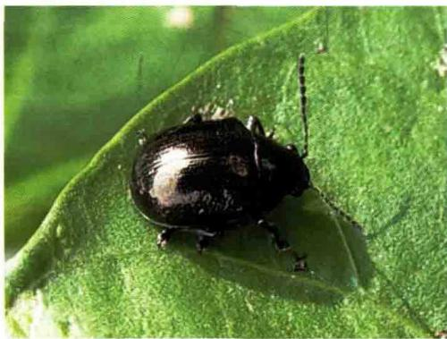

采用包围式喷药，即应从田四周向中央喷，防止成虫逃走。喷药作业时动作宜轻，勿惊扰成虫。

# 小猿叶甲与大猿叶甲

小猿叶甲与大猿叶甲均属鞘翅目叶甲科，是寡食性害虫，主要危害十字花科蔬菜，嗜食白菜、萝卜、花椰菜、芥菜等。小猿叶甲与大猿叶甲常混合发生。

形态特征：见下表。

小猿叶甲与大猿叶甲形态特征比较  

<table><tr><td></td><td>小猿叶甲</td><td>大猿叶甲</td></tr><tr><td>成虫</td><td>体近圆形,蓝黑色,有明显金属光泽,小盾片近圆形,有小刻点;鞘翅上有细密点刻,排成11行,后翅退化,不能飞翔</td><td>体椭圆形,暗蓝黑色,略有金属光泽,小盾片三角形,光滑无刻点;前胸背板及鞘翅上有刻点,后翅发达,能飞翔</td></tr><tr><td>卵</td><td>长椭圆形,一端较钝,暗黄色</td><td>长椭圆形,橙黄色</td></tr><tr><td>幼虫</td><td>初孵幼虫淡黄色,后变褐色,头黑色有光泽,各体节具黑色肉瘤8个,其上有刚毛。沿亚背线的一行肉瘤最大,越向下越小</td><td>头黑色,体灰黑带黄色,各体节有大小不等的黑色肉瘤20个左右,气门下线及基线上肉瘤最显著</td></tr><tr><td>蛹</td><td>近半球形,淡黄色。体上生褐色短毛,尾端不分叉</td><td>近半球形,黄色至黄褐色。体略大,被刚毛,尾端分叉,淡紫色</td></tr></table>

  
小猿叶甲成虫

  
小猿叶甲低龄幼虫