# 一、十字花科蔬菜病虫害

# （一）十字花科蔬菜病害

# 十字花科蔬菜霜霉病

十字花科蔬菜霜霉病主要危害白菜、菜薹、萝卜、甘蓝等，苗期、成株期均可发生，主要危害叶片，也可危害茎、花、花梗及种荚。

症状：一般先从外部叶片开始发病，病叶表面初期出现边缘不明晰的水渍状褪绿、黄化，逐渐产生不均匀的枯黄斑，病斑边缘不明显。受叶脉限制，扩大后呈多角形淡褐色或黄褐色斑块，潮湿时叶背面或叶正面可产生灰色霉层。病叶由外向内发展，病斑多时可连片，也有破裂，叶缘卷缩，叶干枯，发病严重时田块一片枯黄。大白菜进入包心期后，叶片连片枯死，从外叶至内叶，层层干枯，最后只剩下一个叶球；采种株上，危害叶、花梗、花器及种荚，引起花梗肥肿、弯曲，花器被害后变畸形肥大，花瓣为绿色叶片状，不易凋落，种荚被害后呈淡黄色，瘦小，不结实或结实不良。

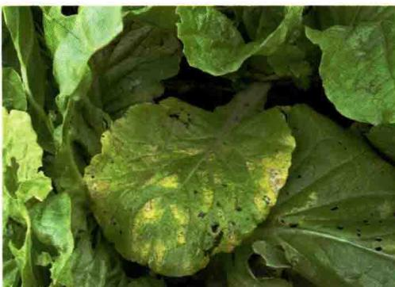  
小白菜霜霉病前期症状

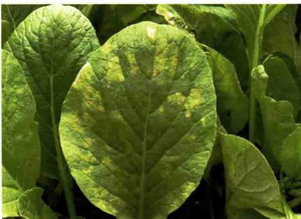  
小白菜霜霉病病叶正面

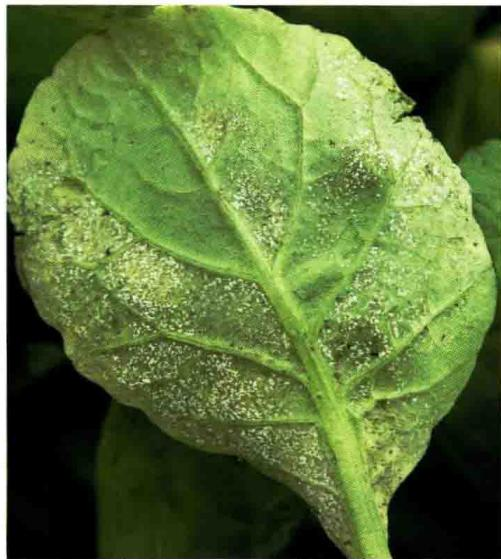  
小白菜霜霉病病叶背面灰白色霉层

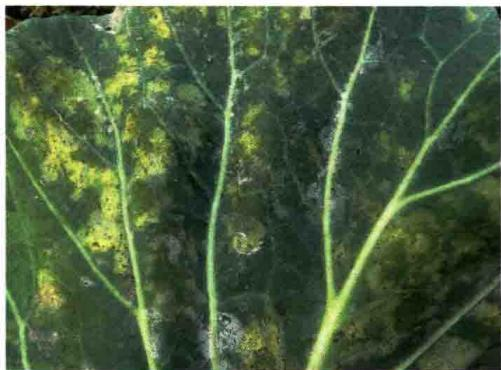  
花椰菜霜霉病病叶正面

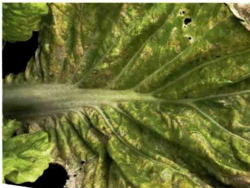  
大白菜霜霉病病叶正面

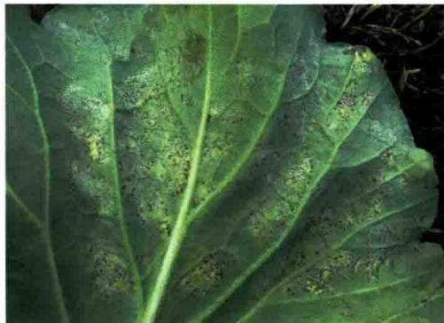  
花椰菜霜霉病病叶背面

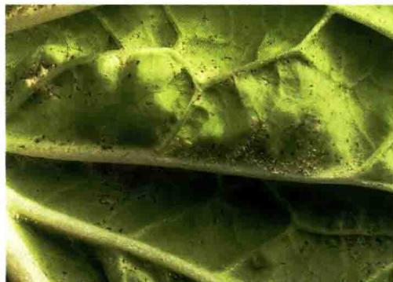  
大白菜霜霉病病叶背面霉层

萝卜叶片受害，多从下部向上部扩展，发病初期先在叶缘出现圆形至多角形褪绿黄斑，扩大后为多角形黄褐色病斑，后叶脉变黑色，最后使叶内变褐，全叶枯死。湿度大时叶背或叶面长出白霉，严重时致叶片干枯。

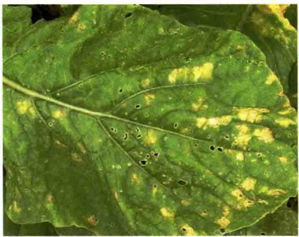  
萝卜霜霉病病叶正面

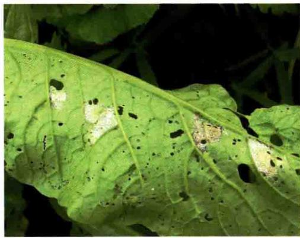  
萝卜霜霉病病叶背面霉层

发生规律：该病由霜霉菌侵染所致。病菌以菌丝体及卵孢子随病残体遗留在田间或潜伏在种子上越冬。病菌喜温暖高湿环境，最适发病温度为 $20\sim 24^{\circ}C$ ，空气相对湿度 $90\%$ 以上。栽培上多年连作、播种期过早、氮肥偏多、种植过密、通风透光差，发病重；早晚温差大、多雨多雾、重露、晴雨相隔，则发病重；地势低洼积水，排水不良的地块发病较早且重。该病主要发生在春秋两季，长江中下游地区在4月中旬至5月上中旬为春季发生高峰期，秋季9月初至11月大白菜莲座期至包心期形成发病高峰。

防治方法：①及时清除病苗、杂草，携出田外深埋或销毁。②提倡与其他类蔬菜实行2～3年轮作。③提倡深沟高畦栽培，适当密植，及时清沟排水，降低田间湿度。温室和大棚等保护地栽培，要合理控制浇水量，适时放风降雨。④播种前可用种子重量 $0.3\%$ 的 $2.5\%$ 咯菌腈悬浮种衣剂拌种包衣，也可使用10毫升上述药剂加水 $150\sim 200$ 毫升混匀后拌种 $5\sim 10$ 千克，包衣后播种。⑤田间出现中心病株时，应及时喷药保护，每隔 $7\sim 10$ 天喷1次，连续喷 $2\sim 3$ 次，喷药液时须均匀周到，特别注意叶背和雨前喷药，药剂要交替使用。发病前可选用 $70\%$ 丙森锌可湿性粉剂 $400\sim 600$ 倍液，或 $80\%$ 代森锰锌可湿性粉剂 $600\sim 800$ 倍液，或 $68.75\%$ 嗅酮·锰锌可分散粒剂 $1000\sim 1500$ 倍液。发病后可选用 $64\%$ 嗅霜·锰锌可湿性粉剂500倍液，或 $68\%$ 甲霜·锰锌水分散粒剂 $600\sim 800$ 倍液，或 $72.2\%$ 霜霉威水剂1000倍液，或 $60\%$ 唑醚·代森联水分散粒剂1000倍液，或 $72\%$ 霜脲·锰锌可湿性粉剂 $600\sim 800$ 倍液，或 $10\%$ 氰霜唑悬浮剂 $2500\sim 3000$ 倍液，或 $52.5\%$ 嗅酮·霜脲氰可分散粒剂 $2000\sim 3000$ 倍液等。

# 十字花科蔬菜软腐病

软腐病又称“烂葫芦”“烂疮瘩”“水烂”“烂肠瘟”。主要危害十字花科中的白菜、甘蓝、萝卜、花椰菜，还可危害番茄、辣椒、马铃薯、黄瓜、芹菜等。

症状：大白菜多为包心期开始发病，叶柄基部与茎基部交界处首先发病，出现半透明水渍状微黄色病斑，前期症状不明显，随着病情发展，白天植株外围叶片在日光照射下表现萎蔫下垂，但早晚可恢复，几天后病株外叶萎蔫，平贴地面。天气干燥时，病叶可失水呈薄纸状，紧贴叶球，叶球外露。严重时叶柄基部和根茎心髓组织腐烂，充满黄色黏稠物，有臭味，一碰就倒。贮藏期病害继续发展，造成烂窖。

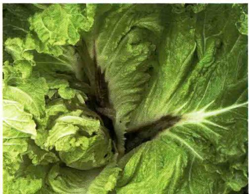  
大白菜软腐病发病状

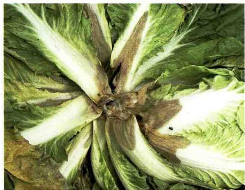  
大白菜软腐病心腐症状

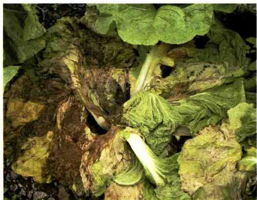  
大白菜软腐病严重发病状

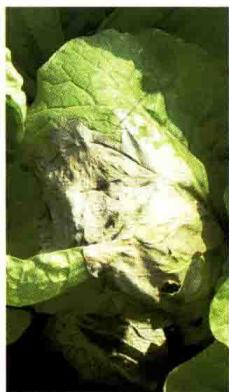

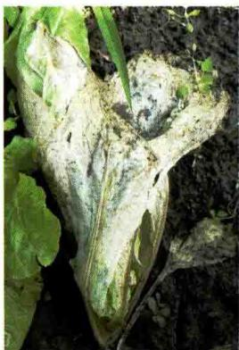  
大白菜软腐病干腐症状

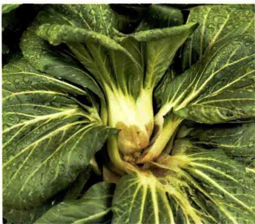  
小白菜软腐病发病状

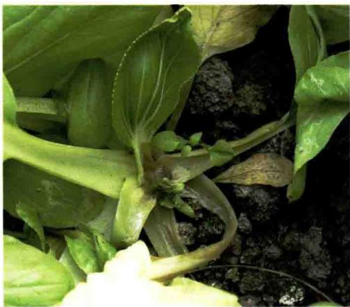  
小白菜软腐病心腐症状

甘蓝发病一般始于结球期，初在外叶或叶球基部出现水渍状斑，植株外层包叶中午萎蔫，早晚恢复，数天后外层叶片不再恢复，病部开始腐烂，叶球外露或植株基部逐渐腐烂成泥状，或塌倒溃烂，叶柄或根茎基部的组织呈灰褐色软腐，严重的全株腐烂，病部散发出恶臭味，有别于黑腐病。

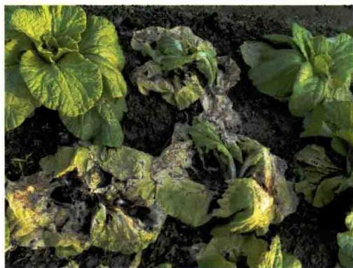  
小白菜软腐病严重发病状

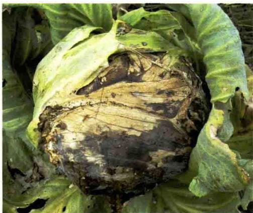  
甘蓝软腐病干腐症状

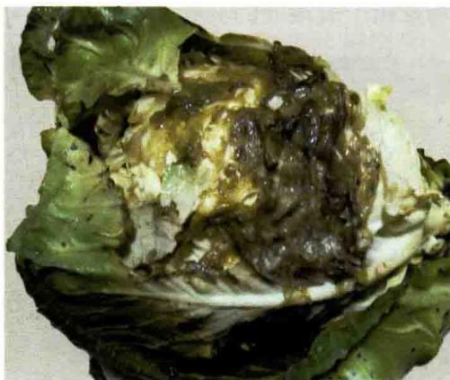  
甘蓝软腐病湿腐症状

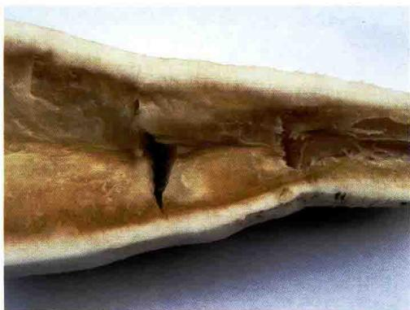

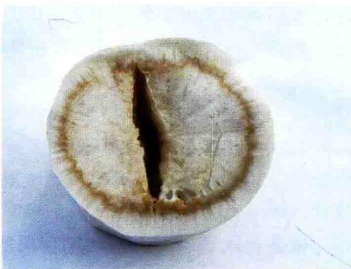  
萝卜缺硼症状

防治方法：①增施有机肥。既可提高土壤的供硼水平，同时能改善土壤的结构和理化性状，增强土壤的保水保肥能力，提高土壤硼的有效性。②平衡氮、磷、钾肥。在合理增施有机肥的基础上，控制氮肥，特别是铵态氮过多，不仅导致蔬菜体内氮和硼的比例失调，还会抑制蔬菜对土壤中硼的吸收；稳施磷肥，宜基施、集中施；硼肥作基肥可与磷肥、有机肥等混合施用，既能提高施用硼肥的均匀性，又可增加施硼效果。硼肥全作基肥时，用量以每亩0.5千克为宜。③叶面喷施，硼砂浓度为 $0.1\% \sim 0.2\%$ 每亩喷50千克，叶片正反两面均匀喷雾。叶菜类蔬菜宜在苗期喷施。缺硼较严重的，隔7～10天后可再喷1次。④适量灌溉。旱时要及时适量灌溉，防止土壤干裂，促进硼的吸收。不可一次性灌水过多，否则排水时易引起土壤水溶性硼淋失，导致土壤缺硼。

# （二）十字花科蔬菜害虫

# 小菜蛾

小菜蛾属鳞翅目菜蛾科，又名小青虫、两头尖、吊丝虫，是寡食性害虫，主要危害甘蓝、薹菜、芥菜、花椰菜、白菜、萝卜等十字花科植物。

形态特征：成虫体灰褐色，头部黄白色，触角丝状，褐色有白纹，静止时向前伸。前、后翅细长，后缘毛很长，前、后翅有黄白色、曲折的波状带纹。成虫停息时两翅覆盖于体背呈屋脊状，接合处形成3个连串的菱

形斑纹。卵椭圆形，稍扁平，初产时乳白色，后变淡黄色。多数为单粒产，大多产在叶背叶脉的凹陷处。幼虫绿色，头黄褐色，头部较尖细，纺锤形，俗称“两头尖”。身体上有稀而少的黑色刚毛。前胸背板上由淡褐色无毛的小点组成两个U形纹。初化蛹时绿色，渐变淡黄绿色，最后为灰褐色，茧呈纺锤形，灰白色丝质薄如网，可透见蛹体。

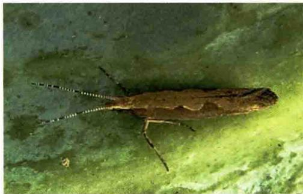  
小菜蛾春夏型成虫

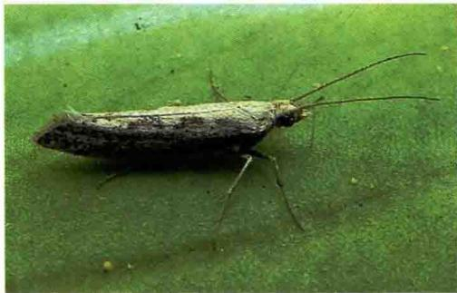  
小菜蛾冬型成虫

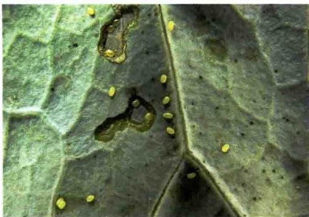  
小菜蛾卵

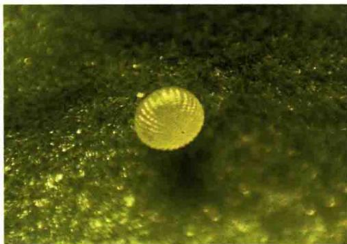

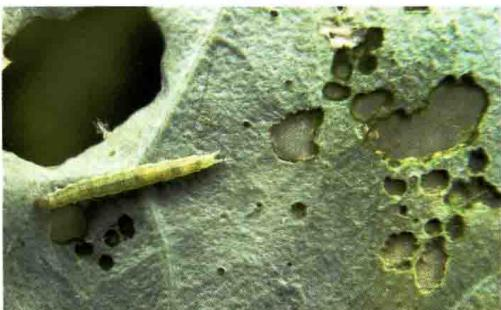  
小菜蛾低龄幼虫

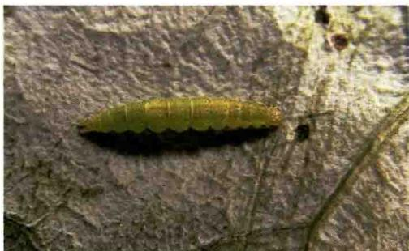  
小菜蛾高龄幼虫

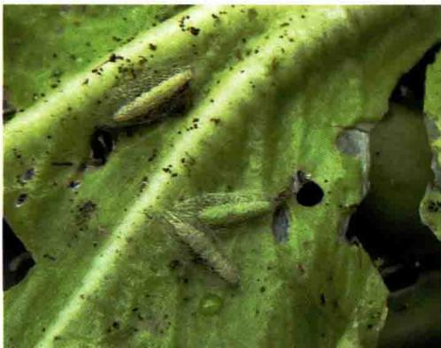  
小菜蛾茧

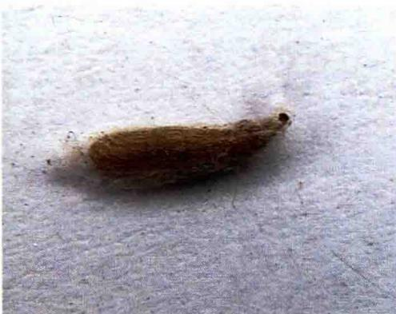  
小菜蛾蛹

危害状：低龄幼虫取食叶肉，留下一层透明的表皮，在叶片上形成一个个透明的斑，称为“开天窗”；三至四龄幼虫可将叶片食成许多大小不同的孔洞和缺刻，严重时全叶被吃成网状。在苗期，幼龄虫常群集于心叶危害生长点，形成“秃顶苗”，使菜不能包心。结球期钻蛀叶球，造成严重减产。在留种菜上危害嫩茎、幼荚和籽粒，影响结实。

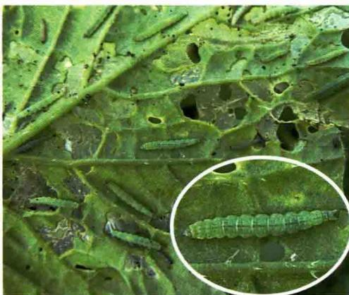  
小菜蛾危害叶片状

生活习性：1年发生2～22代不等，在东北1年发生2～3代，华中、华北发生4～6代，长江流域9～14代，广东、广西18～21代，海南22代。以蛹在墙壁、树干、土缝、杂草及落叶上越冬。成虫昼伏夜出，有趋光性，世代重叠严重。幼虫性活泼，受惊扰时可扭曲身体后退，或吐丝下垂，所以也称“吊丝虫”。发育最适温度为20～30℃，喜干旱，潮湿多雨对其发育不利。十字花科蔬菜栽培面积大、连续种植或管理粗放都有利于此虫发生。东北、华北地区以5—6月和8—9月危害严重，且春季重于秋季。在南方以3—6月和8—11月为发生盛期，其中以8—9月发生数量最多，是全年危害最重的时期，而且秋季重于春季。

防治方法：①合理种植布局，避免十字花科蔬菜周年连作，尤其要避

免夏季的连作。可与瓜类、豆类、茄果类、葱蒜类蔬菜轮作倒茬。小菜蛾发生严重的地区，应与水稻轮作，或夏季休耕。②用频振式杀虫灯、黑光灯和性诱剂诱杀成虫。③蔬菜收获后要及时清洁田间枯残菜叶，及时翻耕菜地，清除田边、路边等处杂草。④推广生物防治技术。可采用多杀霉素、苏云金杆菌、植物杀虫剂、多角体病毒等生物源杀虫剂防治，也可利用保护菜田中的小黑蚁、菜蛾啮小蜂、菜蛾绒茧蜂等天敌种群，控制抗药性害虫的猖獗。⑤合理使用农药。在小菜蛾大发生时，选用高效、低毒、低残留的农药进行防治，防治适期以一至二龄幼虫期为佳。药剂可选用 $2.5\%$ 多杀霉素悬浮剂或 $6\%$ 乙基多杀菌素悬浮剂 $1000\sim 1500$ 倍液，或 $0.3\%$ 印楝素乳油1000倍液，或32000国际单位/毫克苏云金杆菌 $1000\sim 2000$ 倍液，或 $5\%$ 氯虫苯甲酰胺 $1500\sim 2000$ 倍液，或 $5\%$ 氟虫隆乳油、 $5\%$ 氟虫脲乳油1500倍液，或 $1\%$ 甲氨基阿维菌素苯甲酸盐乳油4000倍液，或 $24\%$ 甲氧虫酰肼悬浮剂 $2500\sim 3000$ 倍液，或 $15\%$ 唑虫酰胺乳油 $1200\sim 2000$ 倍液，或 $10\%$ 溴氰虫酰胺悬浮剂2000倍液，或 $22\%$ 氰氟虫腙悬浮剂 $600\sim 800$ 倍液，或 $10.5\%$ 三氟甲吡醚乳油 $800\sim 1200$ 倍液，或 $15\%$ 荨虫威悬浮剂 $3000\sim 4000$ 倍液。⑥提倡药剂混用、轮用，以延缓或阻止害虫抗药性产生。根据小菜蛾危害特点，重点抓好叶背和心叶的喷雾处理，以提高防效。

# 菜粉蝶

菜粉蝶属鳞翅目粉蝶科，又称白粉蝶、白蝴蝶、粉蝶等。幼虫也称菜青虫，危害十字花科、菊科、旋花科、百合科、茄

科、藜科、苋科等9科35种蔬菜，是十字花科蔬菜上的重要害虫，主要危害甘蓝、花椰菜、萝卜、白菜等十字花科蔬菜，偏嗜厚叶类蔬菜。

形态特征：雄蝶乳白色，雌蝶淡黄白色。虫体灰黑色，鳞粉细密。前翅顶角有1个三角形黑斑，翅中下方有2个黑色圆斑，后翅正面前缘离翅基2/3处有1个黑斑。卵散产，形似枪弹形，初产时淡黄色，后变橙黄色，表面有许多纵、横隆起的线。幼虫体青绿色，圆筒形，中段稍肥粗，体表密布细毛，背部有一条不明显的断续的黄色纵线，并有横皱纹，两侧气门线黄色，每节的线上有两个黄斑。蛹纺锤形，两端尖细，体背有3条纵脊，常有一丝吊连在化蛹场所的物体上，化蛹初期为青绿色，逐渐变为灰褐色。

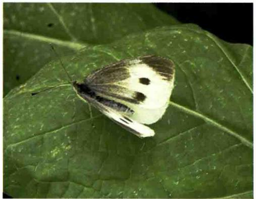  
菜粉蝶成虫

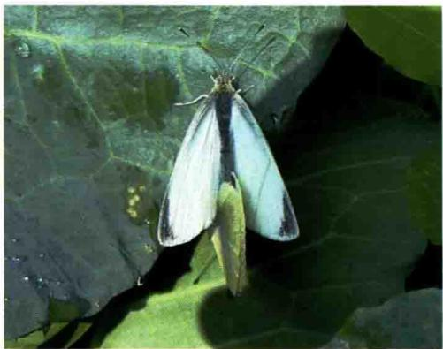  
菜粉蝶成虫交尾

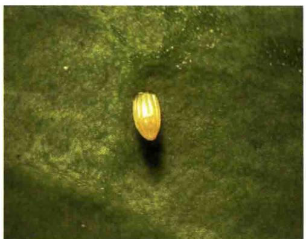  
菜粉蝶卵

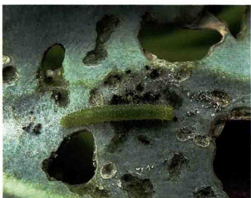  
菜粉蝶低龄幼虫

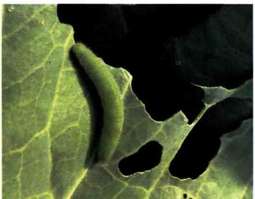  
菜粉蝶高龄幼虫

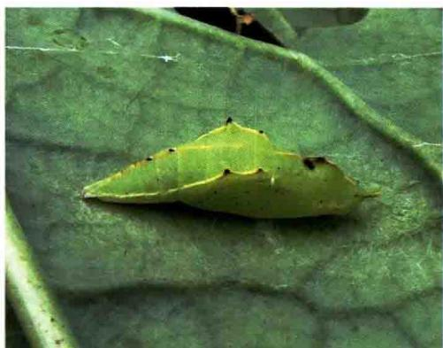  
菜粉蝶前期蛹