# 一、十字花科蔬菜病虫害

# （一）十字花科蔬菜病害

# 十字花科蔬菜霜霉病

十字花科蔬菜霜霉病主要危害白菜、菜薹、萝卜、甘蓝等，苗期、成株期均可发生，主要危害叶片，也可危害茎、花、花梗及种荚。

症状：一般先从外部叶片开始发病，病叶表面初期出现边缘不明晰的水渍状褪绿、黄化，逐渐产生不均匀的枯黄斑，病斑边缘不明显。受叶脉限制，扩大后呈多角形淡褐色或黄褐色斑块，潮湿时叶背面或叶正面可产生灰色霉层。病叶由外向内发展，病斑多时可连片，也有破裂，叶缘卷缩，叶干枯，发病严重时田块一片枯黄。大白菜进入包心期后，叶片连片枯死，从外叶至内叶，层层干枯，最后只剩下一个叶球；采种株上，危害叶、花梗、花器及种荚，引起花梗肥肿、弯曲，花器被害后变畸形肥大，花瓣为绿色叶片状，不易凋落，种荚被害后呈淡黄色，瘦小，不结实或结实不良。

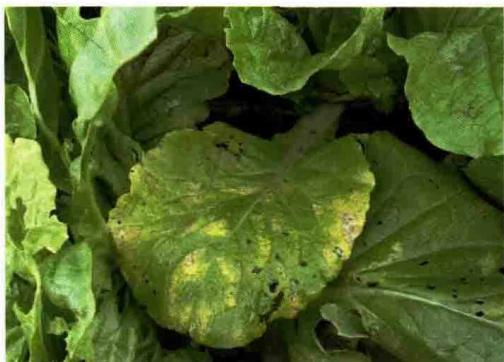  
小白菜霜霉病前期症状

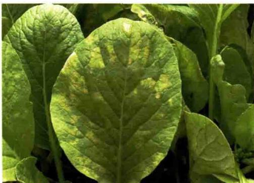  
小白菜霜霉病病叶正面

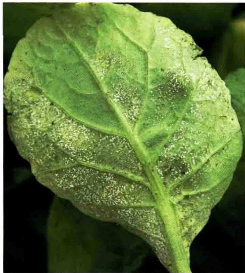  
小白菜霜霉病病叶背面灰白色霉层

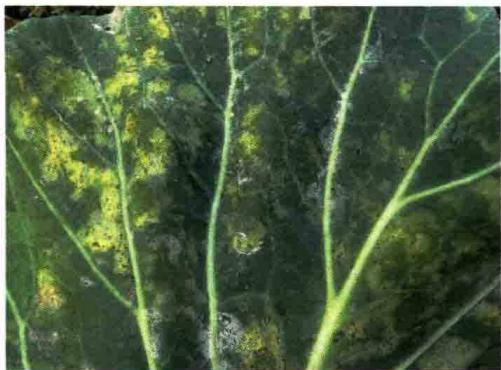  
花椰菜霜霉病病叶正面

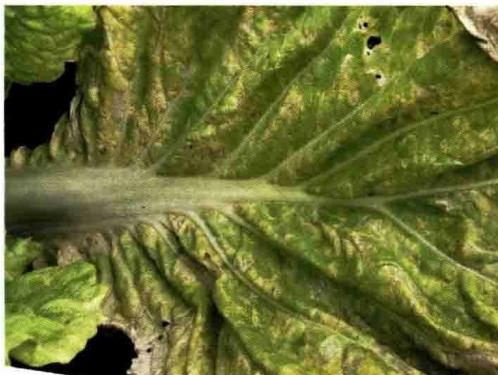  
大白菜霜霉病病叶正面

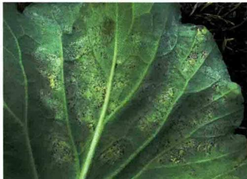  
花椰菜霜霉病病叶背面

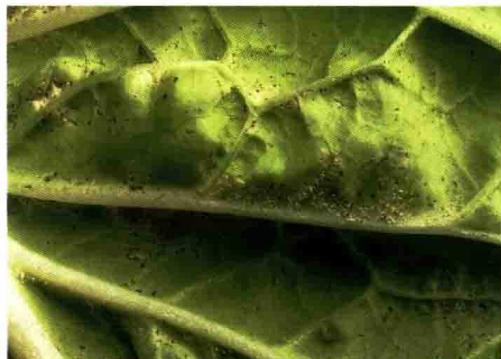  
大白菜霜霉病病叶背面霉层

萝卜叶片受害，多从下部向上部扩展，发病初期先在叶缘出现圆形至多角形褪绿黄斑，扩大后为多角形黄褐色病斑，后叶脉变黑色，最后使叶内变褐，全叶枯死。湿度大时叶背或叶面长出白霉，严重时致叶片干枯。

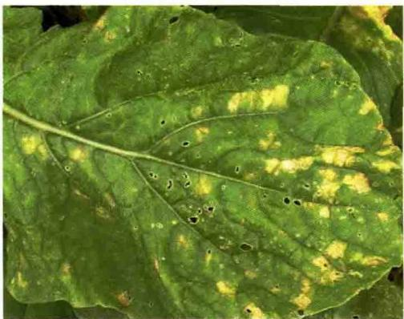  
萝卜霜霉病病叶正面

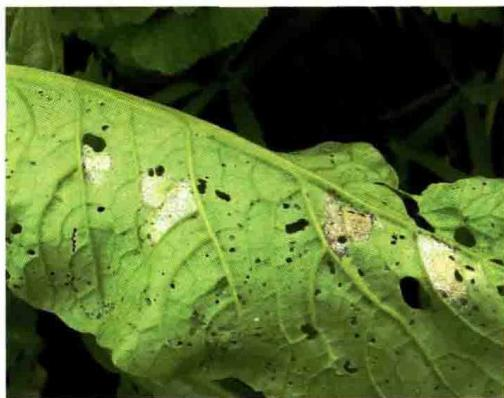  
萝卜霜霉病病叶背面霉层

发生规律：该病由霜霉菌侵染所致。病菌以菌丝体及卵孢子随病残体遗留在田间或潜伏在种子上越冬。病菌喜温暖高湿环境，最适发病温度为 $20\sim 24\%$ ，空气相对湿度 $90\%$ 以上。栽培上多年连作、播种期过早、氮肥偏多、种植过密、通风透光差，发病重；早晚温差大、多雨多雾、重露、晴雨相隔，则发病重；地势低洼积水，排水不良的地块发病较早且重。该病主要发生在春秋两季，长江中下游地区在4月中旬至5月上中旬为春季发生高峰期，秋季9月初至11月大白菜莲座期至包心期形成发病高峰。

防治方法：①及时清除病苗、杂草，携出田外深埋或销毁。②提倡与其他类蔬菜实行2～3年轮作。③提倡深沟高畦栽培，适当密植，及时清沟排水，降低田间湿度。温室和大棚等保护地栽培，要合理控制浇水量，适时放风降雨。④播种前可用种子重量 $0.3\%$ 的 $2.5\%$ 咯菌腈悬浮种衣剂拌种包衣，也可使用10毫升上述药剂加水 $150\sim 200$ 毫升混匀后拌种 $5\sim 10$ 千克，包衣后播种。⑤田间出现中心病株时，应及时喷药保护，每隔 $7\sim 10$ 天喷1次，连续喷 $2\sim 3$ 次，喷药液时须均匀周到，特别注意叶背和雨前喷药，药剂要交替使用。发病前可选用 $70\%$ 丙森锌可湿性粉剂 $400\sim 600$ 倍液，或 $80\%$ 代森锰锌可湿性粉剂 $600\sim 800$ 倍液，或 $68.75\%$ 嗅酮·锰锌可分散粒剂 $1000\sim 1500$ 倍液。发病后可选用 $64\%$ 嗅霜·锰锌可湿性粉剂500倍液，或 $68\%$ 甲霜·锰锌水分散粒剂 $600\sim 800$ 倍液，或 $72.2\%$ 霜霉威水剂1000倍液，或 $60\%$ 唑醚·代森联水分散粒剂1000倍液，或 $72\%$ 霜脲·锰锌可湿性粉剂 $600\sim 800$ 倍液，或 $10\%$ 氰霜唑悬浮剂 $2500\sim 3000$ 倍液，或 $52.5\%$ 嗅酮·霜脲氰可分散粒剂 $2000\sim 3000$ 倍液等。

# 十字花科蔬菜软腐病

软腐病又称“烂葫芦”“烂疮瘩”“水烂”“烂肠瘟”。主要危害十字花科中的白菜、甘蓝、萝卜、花椰菜，还可危害番茄、辣椒、马铃薯、黄瓜、芹菜等。

症状：大白菜多为包心期开始发病，叶柄基部与茎基部交界处首先发病，出现半透明水渍状微黄色病斑，前期症状不明显，随着病情发展，白天植株外围叶片在日光照射下表现萎蔫下垂，但早晚可恢复，几天后病株外叶萎蔫，平贴地面。天气干燥时，病叶可失水呈薄纸状，紧贴叶球，叶球外露。严重时叶柄基部和根茎心髓组织腐烂，充满黄色黏稠物，有臭味，一碰就倒。贮藏期病害继续发展，造成烂窖。

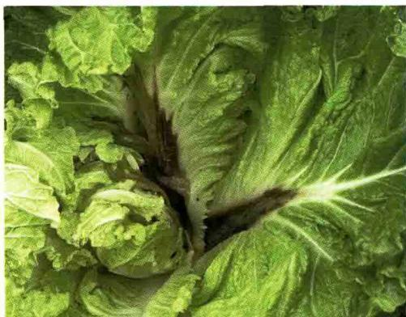  
大白菜软腐病发病状

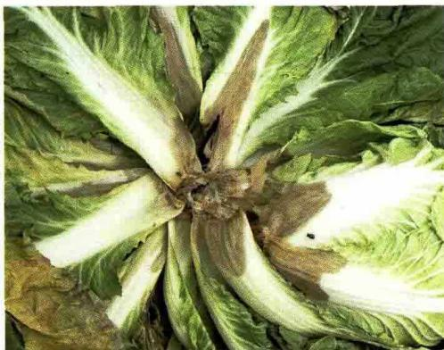  
大白菜软腐病心腐症状

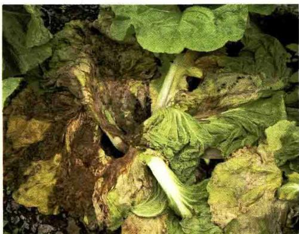  
大白菜软腐病严重发病状

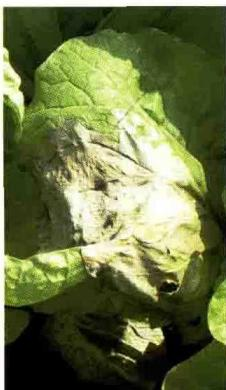

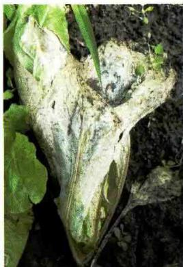  
大白菜软腐病干腐症状

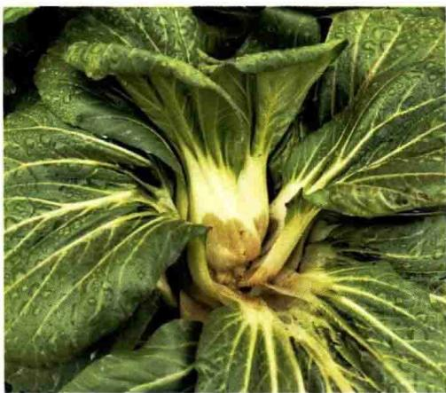  
小白菜软腐病发病状

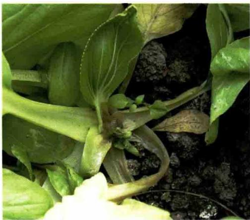  
小白菜软腐病心腐症状

甘蓝发病一般始于结球期，初在外叶或叶球基部出现水渍状斑，植株外层包叶中午萎蔫，早晚恢复，数天后外层叶片不再恢复，病部开始腐烂，叶球外露或植株基部逐渐腐烂成泥状，或塌倒溃烂，叶柄或根茎基部的组织呈灰褐色软腐，严重的全株腐烂，病部散发出恶臭味，有别于黑腐病。

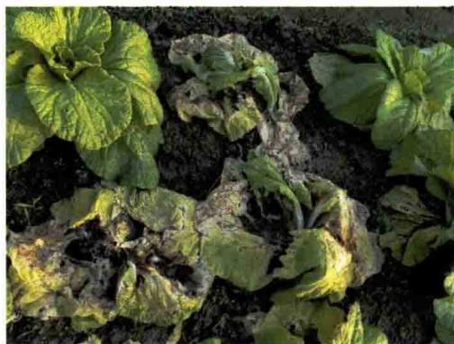  
小白菜软腐病严重发病状

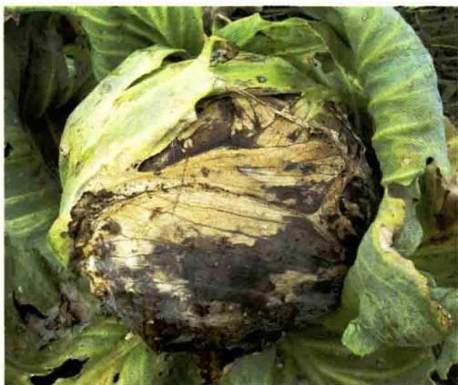  
甘蓝软腐病干腐症状

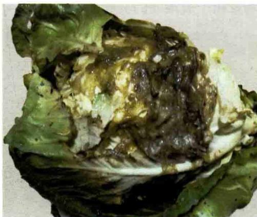  
甘蓝软腐病湿腐症状

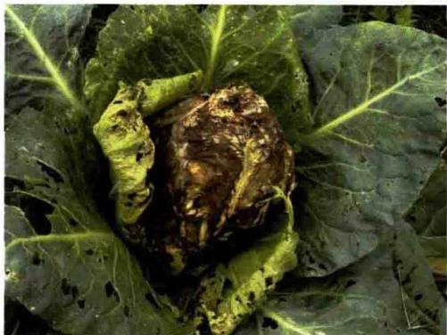  
甘蓝软腐病发病状

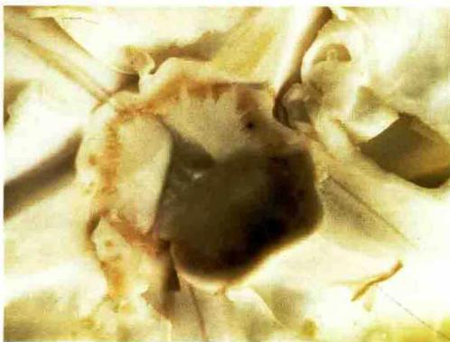  
甘蓝软腐病病茎剖面

该病主要危害萝卜根、短茎、叶柄及叶。根部多从根尖开始发病，出现油渍状的褐色病斑，发展后使根变软腐烂，病健分界明显，常有汁液渗出，继而向上蔓延致心叶变黑褐色软腐，发病组织呈黏滑的稀泥状；肉质根在贮藏期染病会部分或整个变黑褐色软腐。病菌也可从菜心基部侵入引起发病，而植株外部则发育正常，从菜心开始逐渐向外腐烂发病，最后使外部叶片、均发出一股难闻的臭味。

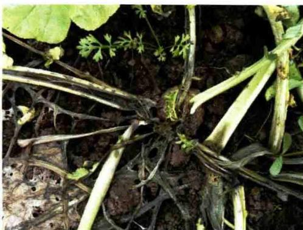  
萝卜软腐病严重发病状

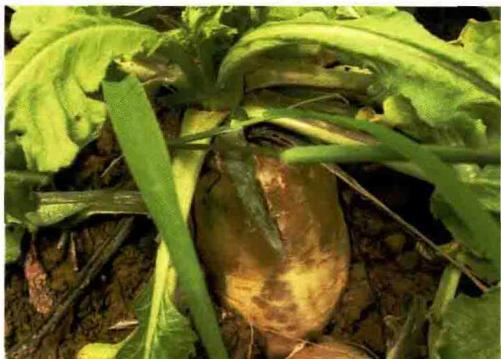  
萝卜软腐病根颈腐烂症状（张发成提供）

叶柄腐烂。此外，植株所有发病部位

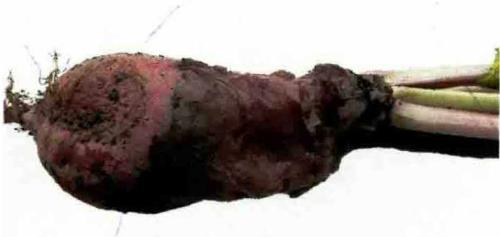  
萝卜软腐病肉质根腐烂（张发成提供）

发生规律：病菌随病株残余组织遗留在田间越冬。病菌主要通过昆虫、雨水和灌溉水传播。从寄主机械伤口、虫伤口或自然裂口侵入，进行侵染。黄曲条跳甲、猿叶甲、菜青虫等昆虫取食不仅可造成伤口，而且还传播软腐病。长江中下游地区主要发病高峰在4—11月。连作地、前茬病重、土壤内病菌多发病重；地势低洼积水、排水不良、土质黏重、土壤偏酸易发病；氮肥施用过多，栽培过密，株行间郁闭，通风透光差，育苗用的营养土带菌、有机肥没有充分腐熟或带菌易发病；早春多雨或梅雨来得早、气候温暖、空气湿度大，秋季多雨、多雾、重露或寒流来得早时易发病。幼苗期发病轻，多从莲座期开始发病。

防治方法：①提倡轮作，尽可能回避与十字花科蔬菜连作，与禾本科作物实行2～3年轮作。②选用抗病品种。③推广采用深沟高畦栽培，做到小水勤灌，提倡喷灌，避免漫灌、串灌，减少病菌随水传播的机会。大棚要注意通风换气降湿，适当控制浇水量，浇水应选择晴朗天气进行，浇水后适当通风。田间操作防止人为的机械损伤。④及时收获，及时清除病残体，发现病株及时拔除，拔除后穴内撒石灰灭菌。⑤治虫防病。早期防地下害虫，如金针虫、蝼蛄、蛴螬等，幼苗期开始防黄曲条跳甲、菜青虫、小菜蛾、猿叶甲、甘蓝夜蛾等。⑥从莲座期开始勘查田头，发病初期7～10天喷药1次，发病盛期5～7天喷药1次，连续2～3次。重病田视病情发展，必要时还要增加喷药次数。发病前或初期及时浇灌病株及周围健株，每株0.25～0.5千克。药剂可选用20%噻菌铜悬浮剂500～600倍液，或40%噻唑锌悬浮剂600～800倍液，或47%春雷·氧氯铜可湿性粉剂800～1000倍液，或33.5%喹啉铜悬浮剂500～800倍液；或每亩*用30%噻森铜悬浮剂100～135毫升，或1000亿孢子/克枯草芽孢杆菌可湿性粉剂50～60克，或2%春雷霉素可湿性粉剂100～150克。注意喷在近地面和植物茎部，重点喷洒病株基部及地表，使药液流入菜心效果为好。

# 十字花科蔬菜病毒病

病毒病主要危害白菜、菜薹、萝卜、芥菜、芜菁、花椰菜、甘蓝，蔬菜各生育期均可发病。

症状：幼苗受害首先心叶出现明脉及沿脉褪绿，后产生淡绿与浓绿相

间的花叶斑驳，叶面皱缩、质脆，心叶扭曲畸形。成株受害时重病株叶片皱缩，叶硬而脆，外叶呈颜色不均匀的花叶，叶背主、侧脉可产生褐色条斑和黑褐色坏死斑点，外叶黄化。严重时植株矮化、畸形，甚至不能包心结球，或部分疏松结球。重病株根系不发达，须根少。留种株受害后，花梗未抽即死亡，病轻的花梗弯曲、畸形，花梗上有纵横裂口，花早枯、结实少、果荚瘦小，籽粒不饱满，发芽率低。

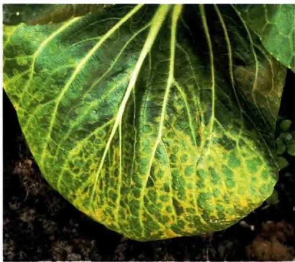  
小白菜病毒病症状

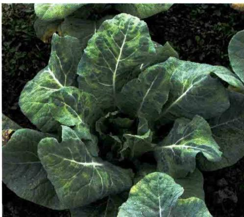  
花椰菜病毒病症状

萝卜整株发病，心叶初现明脉，叶片叶绿素不均，产生深绿和浅绿相间的斑驳花叶，而且沿叶脉产生耳状突起，整个叶片皱缩，重病株矮化。

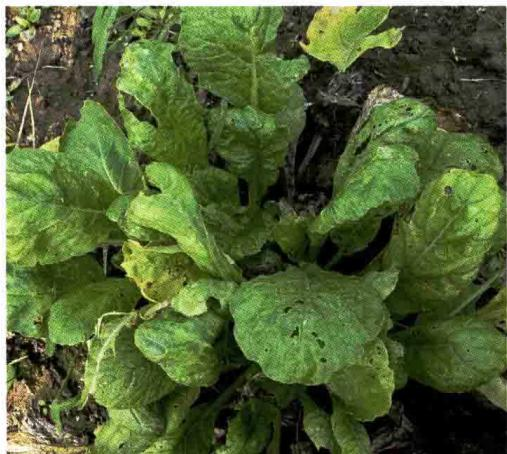

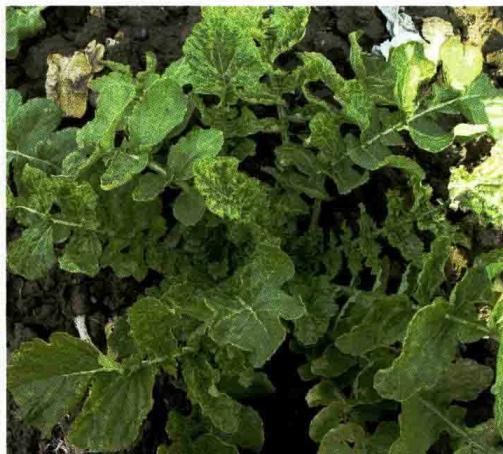  
萝卜病毒病症状

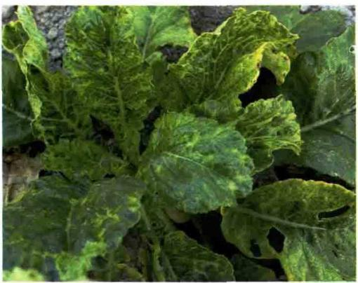

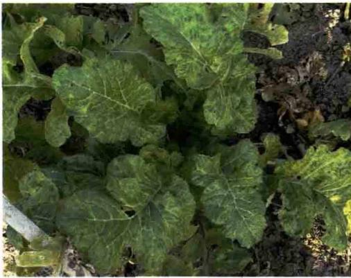  
萝卜病毒病症状

发生规律：病毒可在白菜类、甘蓝类、萝卜等采种株上越冬，也可在保护地十字花科蔬菜及宿根作物如荠菜、菠菜及田边寄主杂草的根部越冬。翌春通过有翅蚜传染，也可通过接触摩擦、农事操作等传播。大白菜苗期易感病，一般7叶期前的幼苗最易感病，特别是苗期遇高温干旱，有利于蚜虫的繁殖、迁飞，传毒频繁，同时不利于大白菜秧苗生长发育，植株抗病力下降，病毒潜育期也短，导致病害早发、重发。莲座期后一般不感病，因此病毒病防治关键时期为幼苗期。长江中下游地区主要发病盛期在春季4—6月，秋季9—12月。

防治方法：①避免十字花科蔬菜相邻而作。②高温干旱季节，苗期应经常灌水，以提高田间湿度，减轻蚜虫危害。③加强栽培管理，增强植株抗病能力。及时拔除病株，培育壮苗。④重点抓好查蚜治蚜工作，切断传毒途径。在7叶期前7～10天，治蚜1次。⑤在发病前或发病初期可喷洒20%盐酸吗啉呱可湿性粉剂400～600倍液，或2%氨基寡糖素水剂300倍液，或1%香菇多糖水剂400倍液，或20%吗胍·乙酸铜可湿性粉剂200～300倍液等，每隔7～10天喷1次，连续喷2～3次，有较明显的抑制病害扩展的效果。

# 十字花科蔬菜炭疽病

十字花科蔬菜炭疽病主要危害白菜、萝卜、芥菜等蔬菜的叶片和叶柄。

症状：病害通常从基部叶片开始发生，初产生灰白色水渍状小点，后扩大为灰褐色的病斑。病斑中部稍凹陷，边缘灰褐色，稍突起，近圆形。

最后病斑中央呈灰白色，半透明，易穿孔。叶脉上的病斑多发生在叶背面，病斑褐色，纺锤形或条状，凹陷较深。叶柄与花梗上的病斑长圆形至纺锤形或梭形，凹陷较深，中间灰白色，边缘深褐色。严重时整个叶面布满病斑，病斑间可相互融合，形成大而不规则形的斑块，使叶片变黄早枯。潮湿情况下，病斑上能产生淡红色黏质物。

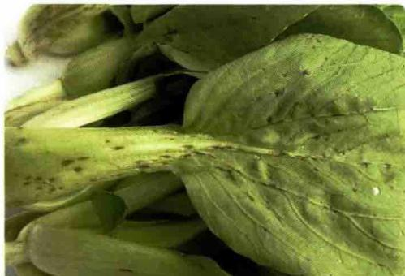  
白菜炭疽病前期症状

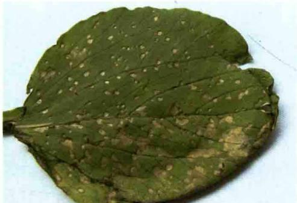  
白菜炭疽病急性期症状

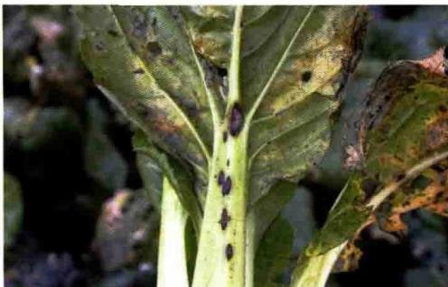  
白菜炭疽病病叶

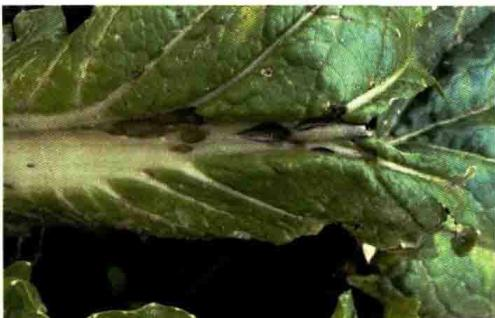  
白菜炭疽病叶柄上的病斑

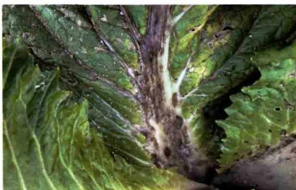  
白菜炭疽病严重时病斑相连

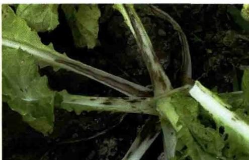  
白菜炭疽病严重时病斑呈条状

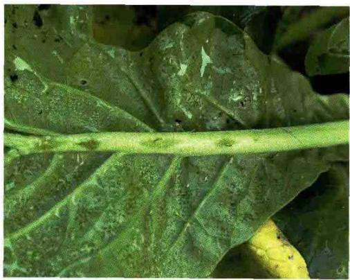  
萝卜炭疽病前期症状

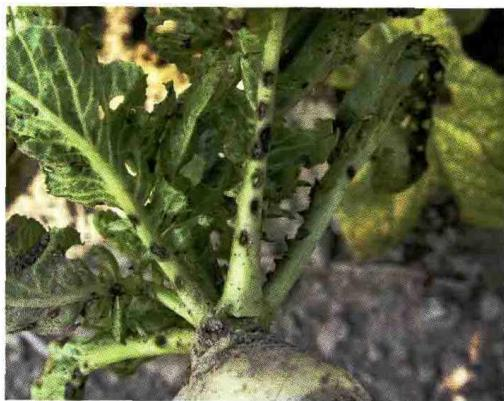  
萝卜炭疽病后期症状

发生规律：病菌主要以菌丝体随病残体遗留在田间越冬，也能以菌丝体黏附在种子上越冬。种子带菌也是重要的初侵染源，播种带菌的种子，在幼苗期即可发病。病菌发育最适温度为 $26 \sim 30^{\circ} \mathrm{C}$ 。高温和高湿是该病流行的主要条件，特别是时晴时雨，更易诱发此病。主要发病期在8月中下旬至11月。

防治方法：① 发病地块提倡与其他蔬菜实行 $2 \sim 3$ 年轮作。② 从无病留种株上采收种子，在播前要做好种子处理。用 $54^{\circ} \mathrm{C}$ 温汤浸种5分钟后，立即移入冷水中冷却，晾干后催芽播种。③ 收获后及时清除病株残体，并携出田外深埋或销毁；深翻土壤，加速病残体腐烂分解。④ 播种前用 $50 \%$ 多菌灵可湿性粉剂600倍液浸种20分钟，后冲洗药液，晾干播种。或用种子重量 $0.4 \%$ 的 $50 \%$ 多菌灵可湿性粉剂拌种。⑤ 发病初期及时用药防治，药剂可选用 $80 \%$ 代森锰锌可湿性粉剂 $600 \sim 800$ 倍液，或 $68.75 \%$ 唑菌酮·代森锰锌水分散粒剂800倍液，或 $20 \%$ 咪鲜胺乳油 $1000 \sim 1500$ 倍液，或 $10 \%$ 苯醚甲环唑水分散粒剂1500倍液，或 $25 \%$ 喹菌酯悬浮剂 $1000 \sim 2000$ 倍液等。每隔 $7 \sim 10$ 天喷1次，连续喷 $2 \sim 3$ 次。

# 十字花科蔬菜黑斑病

黑斑病又称黑霉病，是十字花科蔬菜的常见病害，除危害白菜外，还能危害甘蓝、花椰菜、芥菜、萝卜等。

症状：主要危害叶片，茎、叶柄、花梗和种荚也能受害。多危害老叶，叶片染病多从外叶开始，产生近圆形灰褐色斑。病斑周围产生黄色晕圈，

中间有明显的同心轮纹，在潮湿气候条件下，病部长出黑色霉状物。病害严重时，病斑密布全叶，引起叶片穿孔或枯死。茎和叶柄染病，病班长梭形，呈暗褐色条状凹陷，具轮纹。花梗和种荚感病，出现纵行的长梭形黑色病斑，潮湿时病部也长黑霉。

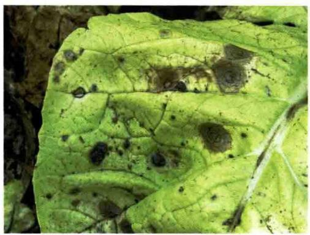  
白菜黑斑病症状

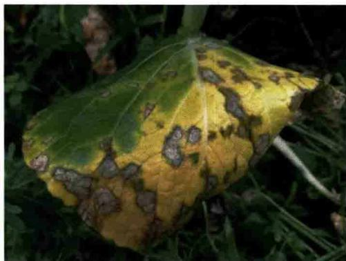  
白菜黑斑病严重发病状

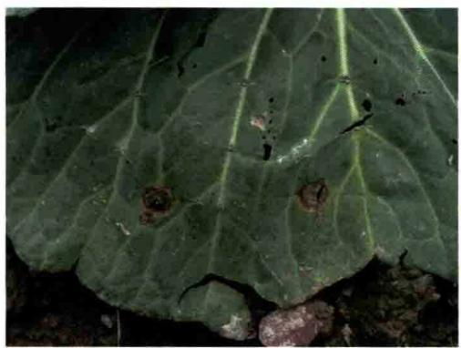  
甘蓝黑斑病症状

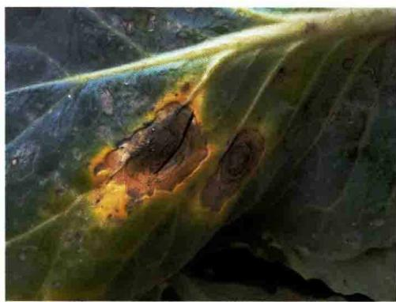  
花椰菜黑斑病症状

发生规律：病原菌主要为芸薹链格孢，有较强的腐生能力。菌丝和分生孢子可在病残体或土壤中越冬、越夏；病荚所结的种子也可以带菌。病害的流行要求高湿度和稍偏低的温度（ $16\sim 20^{\circ}\mathrm{C}$ 最适）。最适感病生育期在成株期至采收期。以春秋两季发生普遍，特别在寄主衰老的情况下，发展较快，危害也较重。在昼夜温差大及高湿条件下，病害发展迅速。春季雨水较多、田间湿度大，秋季易结露均有利于病害发生。

防治方法：①农业防治。发病地块注意与非十字花科蔬菜轮作。作物

收获后彻底清园销毁病残体，翻晒土壤；高畦深沟植菜，增施优质有机底肥，适当增施磷、钾肥。②种子处理。在 $50^{\circ}\mathrm{C}$ 温汤中浸种约20分钟后，移入冷水中冷却，晾干播种；或用种子重量 $0.3\%$ 的 $2.5\%$ 咯菌腈悬浮种衣剂拌种包衣后播种。③应在大白菜封垄后病害流行前适时用 $70\%$ 代森锰锌可湿性粉剂500倍液，或 $50\%$ 异菌脲可湿性粉剂1000倍液预防，或发病初期选用 $2\%$ 春雷霉素水剂 $250\sim 300$ 倍液，或 $43\%$ 戊唑醇悬浮剂 $2000\sim 2500$ 倍液，或 $10\%$ 苯醚甲环唑水分散粒剂 $1200\sim 1500$ 倍液，隔 $7\sim 10$ 天喷1次，连续喷 $2\sim 3$ 次。

# 十字花科蔬菜黑腐病

黑腐病是十字花科蔬菜的常见病害，主要危害甘蓝、花椰菜、萝卜、白菜、芥菜和芜菁等。主要危害叶片、叶球或球茎，苗期和成株期均可染病。

症状：幼苗受害，子叶初始产生水渍状斑，后变黄褐色萎蔫状、枯死，根髓部变黑。成株期染病，引起叶斑或黑脉。成株期发病多从叶缘向内扩展，形成V形的黄褐色至灰褐色叶斑，外围组织淡黄色，与健部无明显界限。病斑内叶脉灰褐色或黑褐色。严重时可导致全叶枯死或外叶局部腐烂，干燥时呈干腐状或穿孔。叶柄染病，沿维管束向上扩展，造成叶片干腐或弯折歪向一侧、脱落。病菌向下发展可使茎部和根部维管束变黑，髓腔中空，严重时植株死亡。病部菌脓不如软腐病明显，但潮湿时手摸病部有黏质感。

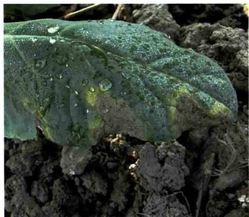

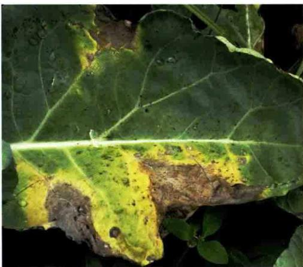  
甘蓝黑腐病症状

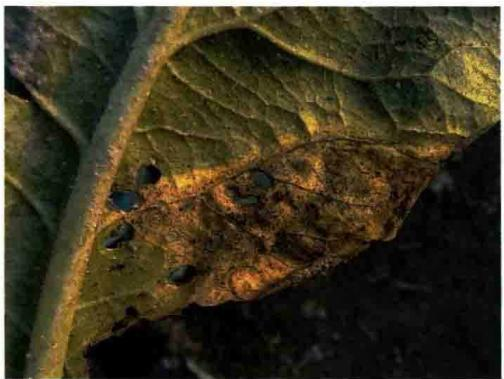  
花椰菜黑腐病症状

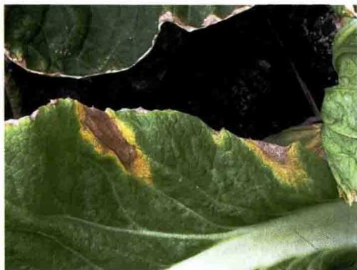  
大白菜黑腐病症状

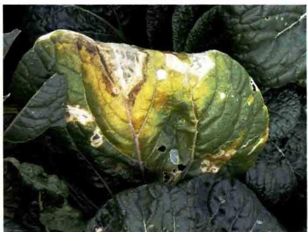  
小白菜黑腐病V形斑

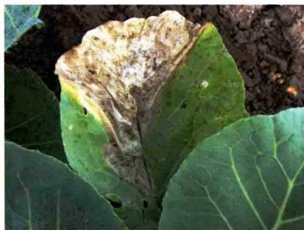  
小白菜黑腐病症状

在萝卜上该病多从叶缘和虫伤处开始发病，向内形成V形或不规则形黄褐色病斑，最后病斑可扩及全叶。肉质根染病出现灰褐色或灰黄色的斑

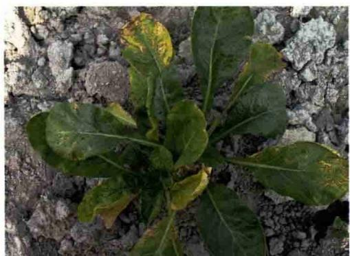

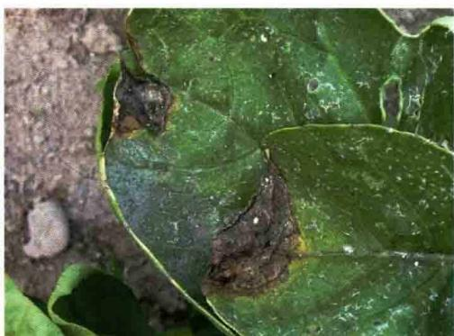  
萝卜黑腐病病叶

痕，表现为内部维管束变黑色，髓部腐烂，严重时内部组织干腐，最后形成空心，但外部症状不明显。随着病害的发展和软腐病菌侵入，加速病情扩展，使肉质根腐烂，并产生恶臭气味。病部菌脓不如软腐病明显，但潮湿时手摸病部有黏质感。

  
萝卜黑腐病肉质根空心

发生规律：病原菌为野油菜黄单胞菌野油菜致病变种，属薄壁菌门黄单胞菌属细菌。病菌能在种子和未分解的病残体内越冬，可存活 $2\sim 3$ 年。病菌生长适温 $25\sim 30^{\circ}\mathrm{C}$ ，耐干燥，高温多雨或露水、大雾天气，利于病菌侵入而发病。地势低洼、排水不良的田块发病较多。最适感病生育期为甘蓝莲座期至包心期、花椰菜花球初现期、萝卜近成熟期。长江中下游地区十字花科蔬菜黑腐病的发病盛期在5—11月。

防治方法：①选留无病种子或种子消毒。②合理轮作，重发病田块提倡与非十字花科作物实行2～3年轮作。③加强栽培管理，提倡高畦栽培，雨后及时开沟排水，防止田间积水。收获后清除病残体，并带出田外深埋或销毁。④治虫防病。在小菜蛾、菜青虫、甜菜夜蛾、斜纹夜蛾、蚜虫、猿叶甲、黄曲条跳甲等害虫盛发前及时防治，防止虫伤及害虫传病。⑤在发病初期开始喷药，药剂可选20%噻菌铜悬浮剂500～600倍液，或47%春雷·氧氯铜可湿性粉剂600～800倍液，或77%硫酸铜钙600倍液等。每隔7～10天喷1次，连续喷2～3次；重病田视病情发展，必要时还要增加喷药次数。

# 十字花科蔬菜菌核病

菌核病主要危害甘蓝、花椰菜、白菜等十字花科蔬菜，还能危害黄瓜、番茄、辣椒、莴苣、菠菜和菜豆等多种蔬菜。主要危害植株的茎基部，也可危害叶片、叶球、叶柄、茎及种荚，苗期和成株期均可发病。

症状：幼苗发病，在近地面的茎基部产生水渍状病斑，很快腐烂或猝倒，并产生明显的白霉。白菜、甘蓝成株发病，近地面的茎、叶柄或叶片上出现水渍状淡褐色凹陷病斑。后病部组织腐烂，引起茎基部或叶球腐烂，病部密生白色或灰白色棉絮状菌丝和散生黑色鼠粪状菌核，腐烂处无臭味。当茎基部病斑环茎一周后全株枯死。茎腐烂后，腐朽呈乱麻状，中空，有白色丝状物，生有黑色鼠粪状菌核。

  
小白菜菌核病发病状

  
小白菜菌核病危害根颈状

  
大白菜菌核病茎基部腐烂

  
大白菜菌核病基部菌核

  
大白菜菌核病严重发病状

  
大白菜菌核病大田发病状

  
花椰菜菌核病发病状

  
甘蓝菌核病前期症状（张发成提供）

  
甘蓝菌核病后期灰白色棉絮状菌丝

  
甘蓝菌核病菌核

  
甘蓝菌核病大田发病状

发生规律、防治方法：参考茄果类蔬菜病害中番茄菌核病。

# 十字花科蔬菜灰霉病

十字花科蔬菜灰霉病主要危害甘蓝、花椰菜、白菜等。

症状：苗期、成株期均可发病。幼苗发病，幼苗呈水渍状腐烂，上生灰色霉层。成株期发病，多从地面较近的叶片开始。发病初期为水渍状，湿度大时病部迅速扩大，呈褐色或淡红褐色，引起腐烂，病部生灰霉后，会产生很小的近圆形黑色菌核。茎基部侵染，发病症状与叶片类似，病情从下向上扩展，或从外层叶延至内层叶，致叶球腐烂，其上生灰霉，后产生小的近圆形黑色菌核。

  
白菜灰霉病病叶

  
花椰菜灰霉病病叶正面

  
花椰菜灰霉病病叶背面灰霉

发生规律、防治方法：参考茄果类蔬菜病害中番茄灰霉病。

# 十字花科蔬菜根肿病

根肿病是世界性具毁灭性病害，危害甘蓝、花椰菜、白菜、菜薹、芥菜、萝卜、芜菁等100多种栽培和野生的十字花科植物。

症状：田间蔬菜苗期易感病，主要危害根部。根部发病后形成肿瘤并逐渐膨大，多靠近上部，呈纺锤形、球形；侧根上的瘤多为手指状，须根上的瘤往往串生在一起，多达几十个。主根上肿瘤大而少。白菜、芥菜、甘蓝、花椰菜发病，肿瘤多在主根上；萝卜、芜菁等发病，肿瘤多在侧根上。肿瘤初期表面光滑，后期龟裂而粗糙。病株地上部生长迟缓、矮小。病株叶片色浅，外层叶中午萎蔫，下午恢复，晴天中午尤为明显。

  
白菜根肿病发病状

  
白菜苗期根肿病症状

  
白菜根肿病肿瘤

发生规律：该病由芸薹根肿菌侵染所致，病菌以休眠孢子囊随病根、病残体在土壤中越冬、越夏，可在土壤中存活 $6\sim 7$ 年。通过雨水、灌溉水、昆虫、土壤线虫或耕作在田间传播。病菌喜酸性土壤，以 $\mathrm{pH}5.4\sim 6.5$ 的土壤最适宜。土壤温度 $20\sim 25^{\circ}C$ 、空气相对湿度 $60\%$ 左右最适于此病发生。一般苗期发病重于成株期。夏秋多雨或梅雨期间多雨的年份发病重。田块连作地，地势低洼、排水不良的田块发病重。1年中9月中旬至11月和3—4月为发病盛期，以9月中旬至11月为全年发病高峰期。

防治方法：①与非十字花科蔬菜实行4～5年的水旱轮作和非十字花科作物轮作。②根肿病虽种子不带菌，但附在种子表面的泥土可带菌传病。③在收获后或病田换茬时要及时清除病株残体，在作物生长期田间发现病株要及时拔除，带出田外深埋或销毁，并在病株周围撒施生石灰消毒，以减少田间菌源。④采用深沟高畦栽培和抗旱小水勤浇有利于控制土壤湿度，减轻病害发生，切忌大水漫灌。多施农家肥和磷、钾肥，控制氮肥施用量。⑤药液灌根。每亩可用 $50\%$ 氯溴异氰尿酸可溶性粉剂 $2\sim 3$ 千克，在播前或移栽前混细土 $40\sim 50$ 千克，施入播种沟或定植穴中。也可用 $50\%$ 氟啶胺悬浮剂300毫升，兑水60升，对播种沟或定植穴的土壤喷雾，然后均匀混土，混土层 $10\sim 15$ 厘米，进行土壤消毒。

# 十字花科蔬菜白锈病

白锈病主要危害白菜、芥菜、苋菜、菠菜，还可危害甘蓝、萝卜等蔬菜。

症状：主要危害叶片，也可危害花器。叶片染病，发病初叶片正面产

生暗褐绿色小斑，扩大后病斑黄绿色，近圆形至不规则形，叶表皮隆起，边缘不明显；叶背病部隆起，产生白色或乳白色疱斑，即孢子堆，病斑表面略有光泽。疱斑最初表面光滑，成熟后表皮破裂，散出白色粉末状物，即病菌的孢子囊。一片叶上疱斑多达几十个，严重时多个病斑连接成片，成为大型枯斑，使叶片枯黄。除危害叶片外，病菌还可侵染植株的茎、花梗及花器，种株的花梗和花器受害，致畸形弯曲肥大，引起不结实，其肉质茎也可现乳白色疱状斑。

  
小白菜白锈病病叶正面

  
小白菜白锈病病叶背面隆起疱斑

  
小白菜白锈病病叶枯黄

  
三月青白锈病叶正面黄绿色病斑

  
三月青白锈病病叶背面疱斑

  
芥菜白锈病病叶

发生规律、防治方法：详见绿叶菜类及其他蔬菜病害中苋菜白锈病。

# 萝卜根结线虫病

症状：主要危害地下部须根和侧根。在受害处产生大小不等的瘤状根结。初生根结乳白色，后变为褐色。根结外部长出细弱的新根，新根上可依次染病，再长根结。轻病株地上部分无明显症状；重病株发育不良、株形矮小，干旱时中午萎蔫或提早枯死。

  
萝卜根结线虫病症状

发生规律：参考茄果类蔬菜根结线虫病。

防治方法：①合理轮作，与禾本科作物尤其是与水稻水旱轮作效果更好。重病田种植大葱、大蒜、韭菜、辣椒等抗病类蔬菜，可明显压低土壤中的线虫数量，减轻下茬受害程度。②有条件的可利用夏季休闲期翻耕晒

田，也可病田淹水1个月，可杀死表层大部分线虫。③育苗移栽要用无病土，培育无病壮苗。其他可参考茄果类蔬菜根结线虫病。

# 缺硼

症状：花椰菜及青花菜缺硼，茎部及花球的肥短花枝心部先呈水渍状，继而变成锈褐色湿腐，有时横裂成孔洞，裂面褐色。有时花球表面也有水渍状，继而变成锈褐色。

根茎类蔬菜缺硼，初期是在根部最粗部位出现深色斑点。生长缓慢，叶片少而且小。如萝卜等若缺硼，生长点萎缩、枯死，出现枯顶，幼叶畸形、扭曲；茎和叶柄粗短、龟裂、硬化，植株矮缩；肉质茎内部发生水渍状，横裂成孔洞。

  
小白菜缺硼症状

  
大白菜缺硼症状

  
萝卜缺硼症状

防治方法：①增施有机肥。既可提高土壤的供硼水平，同时能改善土壤的结构和理化性状，增强土壤的保水保肥能力，提高土壤硼的有效性。②平衡氮、磷、钾肥。在合理增施有机肥的基础上，控制氮肥，特别是铵态氮过多，不仅导致蔬菜体内氮和硼的比例失调，还会抑制蔬菜对土壤中混合施用，既能提高施用硼肥的均匀性，又可增加施硼效果。硼肥全作基，每亩喷50千克，叶片正反两面均匀喷雾。叶菜类蔬菜宜在苗期喷施。缺硼防止土壤干裂，促进硼的吸收。不可一次性灌水过多，否则排土土壤水溶性硼淋失，导致土壤缺硼。

# (二) 十字花科蔬菜害虫

# 小菜蛾

小菜蛾属鳞翅目菜蛾科，又名小青虫、两头尖、吊丝虫，小等十字花科植物形态特征：成虫体灰褐色，头部黄白色，触角丝状，褐色有白纹，静纹。成虫停息时两翅覆盖于体背呈屋脊状，接合处形成3个连串的菱

形斑纹。卵椭圆形，稍扁平，初产时乳白色，后变淡黄色。多数为单粒产，大多产在叶背叶脉的凹陷处。幼虫绿色，头黄褐色，头部较尖细，纺锤形，俗称“两头尖”。身体上有稀而少的黑色刚毛。前胸背板上由淡褐色无毛的小点组成两个U形纹。初化蛹时绿色，渐变淡黄绿色，最后为灰褐色，茧呈纺锤形，灰白色丝质薄如网，可透见蛹体。

  
小菜蛾春夏型成虫

  
小菜蛾冬型成虫

  
小菜蛾卵

  
小菜蛾低龄幼虫

  
小菜蛾高龄幼虫

  
小菜蛾茧

  
小菜蛾蛹

危害状：低龄幼虫取食叶肉，留下一层透明的表皮，在叶片上形成一个个透明的斑，称为“开天窗”；三至四龄幼虫可将叶片食成许多大小不同的孔洞和缺刻，严重时全叶被吃成网状。在苗期，幼龄虫常群集于心叶危害生长点，形成“秃顶苗”，使菜不能包心。结球期钻蛀叶球，造成严重减产。在留种菜上危害嫩茎、幼荚和籽粒，影响结实。

  
小菜蛾危害叶片状

生活习性：1年发生2～22代不等，在东北1年发生2～3代，华中、华北发生4～6代，长江流域9～14代，广东、广西18～21代，海南22代。以蛹在墙壁、树干、土缝、杂草及落叶上越冬。成虫昼伏夜出，有趋光性，世代重叠严重。幼虫性活泼，受惊扰时可扭曲身体后退，或吐丝下垂，所以也称“吊丝虫”。发育最适温度为20～30℃，喜干旱，潮湿多雨对其发育不利。十字花科蔬菜栽培面积大、连续种植或管理粗放都有利于此虫发生。东北、华北地区以5—6月和8—9月危害严重，且春季重于秋季。在南方以3—6月和8—11月为发生盛期，其中以8—9月发生数量最多，是全年危害最重的时期，而且秋季重于春季。

防治方法：①合理种植布局，避免十字花科蔬菜周年连作，尤其要避

免夏季的连作。可与瓜类、豆类、茄果类、葱蒜类蔬菜轮作倒茬。小菜蛾发生严重的地区，应与水稻轮作，或夏季休耕。②用频振式杀虫灯、黑光灯和性诱剂诱杀成虫。③蔬菜收获后要及时清洁田间枯残菜叶，及时翻耕菜地，清除田边、路边等处杂草。④推广生物防治技术。可采用多杀霉素、苏云金杆菌、植物杀虫剂、多角体病毒等生物源杀虫剂防治，也可利用保护菜田中的小黑蚁、菜蛾啮小蜂、菜蛾绒茧蜂等天敌种群，控制抗药性害虫的猖獗。⑤合理使用农药。在小菜蛾大发生时，选用高效、低毒、低残留的农药进行防治，防治适期以一至二龄幼虫期为佳。药剂可选用 $2.5\%$ 多杀霉素悬浮剂或 $6\%$ 乙基多杀菌素悬浮剂 $1000\sim 1500$ 倍液，或 $0.3\%$ 印楝素乳油1000倍液，或32000国际单位/毫克苏云金杆菌 $1000\sim 2000$ 倍液，或 $5\%$ 氯虫苯甲酰胺 $1500\sim 2000$ 倍液，或 $5\%$ 氟虫隆乳油、 $5\%$ 氟虫脲乳油1500倍液，或 $1\%$ 甲氨基阿维菌素苯甲酸盐乳油4000倍液，或 $24\%$ 甲氧虫酰肼悬浮剂 $2500\sim 3000$ 倍液，或 $15\%$ 唑虫酰胺乳油 $1200\sim 2000$ 倍液，或 $10\%$ 溴氰虫酰胺悬浮剂2000倍液，或 $22\%$ 氰氟虫腙悬浮剂 $600\sim 800$ 倍液，或 $10.5\%$ 三氟甲吡醚乳油 $800\sim 1200$ 倍液，或 $15\%$ 荠虫威悬浮剂 $3000\sim 4000$ 倍液。⑥提倡药剂混用、轮用，以延缓或阻止害虫抗药性产生。根据小菜蛾危害特点，重点抓好叶背和心叶的喷雾处理，以提高防效。

# 菜粉蝶

菜粉蝶属鳞翅目粉蝶科，又称白粉蝶、白蝴蝶、粉蝶等。幼虫也称菜青虫，危害十字花科、菊科、旋花科、百合科、茄

科、藜科、苋科等9科35种蔬菜，是十字花科蔬菜上的重要害虫，主要危害甘蓝、花椰菜、萝卜、白菜等十字花科蔬菜，偏嗜厚叶类蔬菜。

形态特征：雄蝶乳白色，雌蝶淡黄白色。虫体灰黑色，鳞粉细密。前翅顶角有1个三角形黑斑，翅中下方有2个黑色圆斑，后翅正面前缘离翅基2/3处有1个黑斑。卵散产，形似枪弹形，初产时淡黄色，后变橙黄色，表面有许多纵、横隆起的线。幼虫体青绿色，圆筒形，中段稍肥粗，体表密布细毛，背部有一条不明显的断续的黄色纵线，并有横皱纹，两侧气门线黄色，每节的线上有两个黄斑。蛹纺锤形，两端尖细，体背有3条纵脊，常有一丝吊连在化蛹场所的物体上，化蛹初期为青绿色，逐渐变为灰褐色。

  
菜粉蝶成虫

  
菜粉蝶成虫交尾

  
菜粉蝶卵

  
菜粉蝶低龄幼虫

  
菜粉蝶高龄幼虫

  
菜粉蝶前期蛹

  
菜粉蝶后期蛹

  
菜粉蝶不同时期蛹

危害状：幼虫食叶，二龄前啃食叶肉，留下一层透明的表皮，三龄后可蚕食整个叶片，咬成孔洞和缺刻。老龄幼虫取食迅速，食量大，轻则虫口累累，重则仅剩下叶脉，幼苗受害严重时，整株死亡。菜青虫取食时，边取食边排出粪便，污染花椰菜球茎，所造成的伤口易引起软腐病、黑腐病。

  
菜粉蝶幼虫危害小白菜

  
菜粉蝶幼虫危害甘蓝

  
菜粉蝶幼虫严重危害甘蓝

  
菜粉蝶幼虫严重危害大白菜

  
菜粉蝶幼虫严重危害花椰菜

  
菜粉蝶幼虫危害花椰菜花球

生活习性：黑龙江1年发生3～4代，河北4～5代，山东5～6代，浙江8～9代，华南12代，以蛹在寄主植物附近的篱笆、风障、树干上及杂草或残枝落叶间越冬。世代重叠现象严重。雌虫产卵对十字花科蔬菜有很强的趋性，尤以厚叶类

的甘蓝和花椰菜着卵量大，卵散产，夏季多产于叶片背面，冬季多产在叶片正面。幼虫偏嗜十字花科蔬菜，其中又偏好甘蓝、花椰菜、白菜、萝卜等。幼虫可转株危害，有假死性。东北地区的发生危害盛期为7月和9月，华北地区5月中旬至6月和8—9月，长江中下游4月下旬至6月和9—10月，

华南地区多在3月前后和10—11月。

防治方法：利用防虫网育苗，防止在苗上产卵。药剂防治一般在卵高峰后1周左右，即幼虫孵化盛期至三龄幼虫前用药，连续使用 $2\sim 3$ 次。注意农药交替轮换使用，并于早上或傍晚在植株叶片背面、正面均匀喷药。其他参考小菜蛾防治。

# 菜螟

菜螟属鳞翅目螟蛾科，俗称菜心野螟、萝卜螟、白菜螟、甘蓝螟、钻心虫，是一种钻蛀性害虫，主要危害十字花科白菜类、甘蓝类、芥菜类，以及萝卜、菠菜，尤以萝卜、白菜、甘蓝受害重。

形态特征：成虫体为灰褐色或黄褐色小型蛾类。前翅灰褐色至黄褐色，

有2条波状横纹，近翅中央有一灰黑色有白边肾形纹，斑外围有灰白色晕圈。翅外缘有一排黑色小点，后翅灰白色。卵椭圆形，扁平，表面有不规则网状纹，初产时淡黄色，孵化前橙黄色。幼虫共5龄，体淡黄绿色，体背有较模糊的5条褐色背线，各节体背长有毛瘤，中、后胸各6对，腹部各节前排8个，后排2个。幼虫老熟后变为桃红色。蛹

  
菜螟成虫

  
菜螟幼虫

  
菜螟幼虫及危害状

黄褐色，翅芽长达第四腹节的后缘，腹部末端略弯，其上有刺4根。

危害状：幼苗期受害，蛀食心叶及叶片，受害苗生长点被破坏而停止生长或萎蔫死亡，造成缺苗断垄。幼虫孵化后，大多潜入叶面表皮下，啃食叶肉，初孵幼虫隧道宽短；二龄后又钻出叶表皮，在叶面活动；三龄后多钻入菜心，吐丝将心叶缠结，藏身其中，食害心叶，使心叶枯死并且不能再抽出心叶；四至五龄幼虫可由心叶或叶柄蛀入茎髓或根部，蛀孔显著，孔外缀有细丝，并有排出的潮湿虫粪，易于识别。甘蓝、大白菜受害后则不能结球或包心，并能传播软腐病。

  
菜螟幼虫危害萝卜叶片

  
菜螟幼虫危害萝卜心叶

  
菜螟幼虫严重危害萝卜

  
菜螟幼虫危害芥菜

生活习性：1年发生3～9代，北京、山东3～4代，上海、浙江6～7代，广西柳州9代，以老熟幼虫在地表吐丝黏着泥土、枯叶做囊越冬。在

广州地区无明显越冬现象。越冬幼虫于翌年春在 $6\sim 10$ 厘米深的土中结茧化蛹，也有在土壤表面残株落叶间化蛹。成虫昼伏夜出，稍有趋光性，飞翔力弱。幼虫有吐丝下垂及转株危害的习性，1头幼虫可转株危害 $4\sim 5$ 株。世代重叠。秋季天气高温干燥，有利于菜螟发生。菜螟幼虫危害期为5—11月，春、秋两季都有发生，以秋季危害较重，长江中下游地区以8—9月危害最重。

防治方法：①及时春耕灭茬，可消灭部分越冬虫源。②在间苗、定苗时，如发现菜心被丝缠住，可随手捏杀。③掌握在幼虫孵化始盛期，菜苗初见心叶被害时防治，施药部位尽量喷到心叶上，防治间隔期 $7\sim 10$ 天，连续喷雾防治 $1\sim 3$ 次。药剂可选用 $5\%$ 虱螨脲乳油 $1000\sim 1500$ 倍液，或 $24\%$ 甲氧虫酰肼乳油 $2500\sim 3000$ 倍液，或 $10\%$ 溴氰虫酰胺可分散油悬浮剂2000倍液，或 $30\%$ 氯虫·噻虫嗪悬浮剂2500倍液，或 $2.5\%$ 氯氟氰菊酯乳油3000倍液，或 $5\%$ 定虫隆乳油 $2000\sim 2500$ 倍液，或 $2.5\%$ 联苯菊酯乳油3000倍液。

# 斜纹夜蛾

斜纹夜蛾属鳞翅目夜蛾科，别名莲纹夜蛾、莲纹夜盗蛾，俗称花虫、黑头虫，是我国农业生产上的主要害虫之一。寄生

范围极广，包括白菜、甘蓝、芋、莲藕及豆类等多达99科290多种植物，是一种间歇性发生的暴食性、杂食性害虫。

形态特征：成虫体深褐色，前翅灰褐色，前翅环纹和肾纹之间由3条白线组成明显的较宽斜纹，呈波浪形，故名斜纹夜蛾。自基部向外缘有1条白纹，外缘各脉间有1列黑点。前、后翅常有紫红色闪光。后翅白色，无斑纹。卵馒头状、块产，表面覆盖有灰黄色或棕黄色的疏松绒毛。老熟幼虫头部黑褐色，体色多变，胴部体色因寄主和虫口密度不同而呈土黄色、青黄色、灰褐色及暗绿色，背线、亚背线及气门下线均为灰黄色及橙色。从中胸到第九腹节上有近似三角形的黑斑各1对，其中第一、第七、第八腹节上的黑斑最大。蛹赭红色，腹背面第四至七节近前缘处有1个小刻点，有1对强大的臀刺，刺基分开。气门黑褐色，椭圆形隆起。

危害状：主要以幼虫咬食叶、蕾、花及果实。初孵幼虫群集取食，三龄前低龄幼虫啃食叶肉，残留表皮，形成半透明纸状或“天窗”。三龄后分

散危害叶片、嫩茎，四龄后进入暴食期，多在傍晚危害。大龄幼虫直接取食叶片、嫩茎，形成孔洞、缺刻或秃尖等。老龄时进入暴食阶段，虫口密度高时，将叶片吃光，仅留主脉，呈扫帚状。排泄粪便污染蔬菜，造成组织腐烂，严重时造成死亡。

  
斜纹夜蛾成虫

  
斜纹夜蛾卵块

  
斜纹夜蛾初孵幼虫

  
斜纹夜蛾低龄幼虫

  
斜纹夜蛾不同体色幼虫

  
斜纹夜蛾不同体色幼虫

  
斜纹夜蛾蛹背面

  
斜纹夜蛾蛹腹面

  
斜纹夜蛾初孵幼虫群集危害

  
斜纹夜蛾低龄幼虫危害造成孔洞

  
斜纹夜蛾低龄幼虫啃食叶肉

  
斜纹夜蛾幼虫危害白菜

  
斜纹夜蛾幼虫严重危害白菜

  
斜纹夜蛾幼虫将白菜叶片吃光

  
斜纹夜蛾危害甘蓝

  
斜纹夜蛾危害花椰菜

生活习性：长江流域1年发生 $5\sim 6$ 代，华北地区 $4\sim 5$ 代，华南地区 $8\sim 9$ 代，以蛹在土下 $3\sim 5$ 厘米处越冬，世代重叠。成虫有强烈的趋光性和趋化性，对糖酒醋液及发酵的胡萝卜、麦芽、豆饼、牛粪等也有趋性，昼伏夜出，飞翔力强。卵多产于高大、茂密、浓绿的边际作物上，以植株中部叶片背面叶脉分权处最多，多数多层排列，卵块上覆盖棕黄色绒毛。初孵时不怕光，聚集叶背附近取食，三龄后分散取食，四龄以后和成虫一样，出现背光性，白天躲在叶下土表处或土缝里，傍晚后爬到植株上取食叶片。幼虫有假死性及自相残杀现象，遇惊扰后四处爬散或吐丝下坠或假死落地。幼虫老熟后，一般在土下 $3\sim 7$ 厘米处造一卵圆形蛹室化蛹。土壤板结，则在枯枝落叶下化蛹。降水量少、高温干旱，有利于斜纹夜蛾发生，常在夏、秋季大量发生。长江流域多在7—8月大发生，黄河流域多在8—9月大发生。浙江第一至五代发生期分别为6月中下旬至7月中下旬、7月中下旬至8月上中旬、8月上中旬至9月上中旬、9月上中旬至10月中下旬。

防治方法：①采用黑光灯或频振式杀虫灯诱杀成虫。②糖醋液诱杀成虫。③清洁田园。④全面覆盖大棚或大棚顶部覆盖防雨薄膜，大棚四周围盖防虫网。⑤在农事操作中摘除卵块和幼虫群集叶。⑥用斜纹夜蛾性诱剂诱杀。⑦应用生物农药和高效、低毒、低残留化学农药，在卵孵高峰至低龄幼虫盛发期，突击用药。最好在三龄前施药，并以傍晚喷药为佳。低龄幼虫药剂可选用 $20\%$ 虫酰肼悬浮剂 $600\sim 1000$ 倍液，或 $5\%$ 氟虫脲乳油或 $5\%$ 定虫隆乳油 $1500\sim 2000$ 倍液，或 $24\%$ 甲氧虫酰肼乳油 $2500\sim 3000$ 倍液，或 $5\%$ 氯虫苯甲酰胺悬浮剂 $1000\sim 1500$ 倍液，或 $22\%$ 氰氟虫脲水分散粒剂 $600\sim 800$ 倍液，或 $10\%$ 虫螨腈悬浮剂 $1000\sim 2000$ 倍液，或 $15\%$ 唑虫酰胺乳油1000倍液，高龄幼虫可用 $15\%$ 苗虫威悬浮剂 $3500\sim 4500$ 倍液，或 $5\%$ 甲维盐乳油4000倍液，或 $5\%$ 虱螨脲乳油1000倍液。隔 $7\sim 10$ 天1次，连用 $2\sim 3$ 次。注意交替使用农药。

# 甜菜夜蛾

甜菜夜蛾属鳞翅目夜蛾科，杂食性害虫，可危害十字花科中的甘蓝、白菜、萝卜，还可危害芹菜、胡萝卜、芦笋、菠菜、苋菜、辣椒、豇豆、茄子、番茄、菠菜、大葱等蔬菜。

形态特征：成虫体灰褐色。前翅中央近前缘外方有肾形斑1个，内方有圆

形斑1个。后翅银白色。卵圆馒头形，白色，表面有放射状的隆起线。幼虫体色变化很大，有绿色、暗绿色至黑褐色。腹部体侧气门下线为明显的黄白色纵带，有的带粉红色，带的末端直达腹部末端，不弯到臀足上。蛹黄褐色。

  
甜菜夜蛾成虫

  
甜菜夜蛾卵块

  
甜菜夜蛾初孵幼虫及危害状

  
甜菜夜蛾低龄幼虫及危害状

  
甜菜夜蛾低龄幼虫

  
甜菜夜蛾高龄幼虫及危害状

  
甜菜夜蛾高龄幼虫

  
甜菜夜蛾老熟幼虫

  
甜菜夜蛾预蛹

  
甜菜夜蛾化蛹初期

  
甜菜夜蛾背面

  
甜菜夜蛾腹侧面

危害状：以幼虫危害叶片，初孵幼虫群集叶背，吐丝结网，在其内取食叶肉，留下表皮，吃成透明的小孔。三龄后可将叶片吃成缺刻，严重时仅余叶脉和叶柄，致使菜苗死亡，造成缺苗断垄，甚至毁种。三龄以上的幼虫还可钻蛀甜椒、番茄果实，造成落果、烂果。

  
甜菜夜蛾幼虫危害状

  
甜菜夜蛾严重危害状

生活习性：长江流域1年发生 $4\sim 6$ 代，广东 $10\sim 11$ 代，华北 $3\sim 4$ 代，以蛹在土中越冬，世代重叠。当土温升至 $10^{\circ}\mathrm{C}$ 以上时，蛹开始羽化。成虫昼伏夜出，有强趋光性和弱趋化性。幼虫有假死性，受震后即落地。当数量大时，有成群迁移的习性。幼虫当食料缺乏时有自相残杀的习性。幼虫畏光，通常早晚或阴天在地上部取食，白天大都藏匿于叶背或茂密植株的中下部，有时隐藏于松表土及枯枝落叶中。幼虫老熟后，钻入 $4\sim 9$ 厘米的土内吐丝筑室化蛹。甜菜夜蛾喜温且对高温适应性强，在高温干旱年份常猖獗成灾，降水量大对其存活、繁殖和发生不利。一般以8月中旬至9月中旬虫口密度高。在北方，全年以7月以后发生严重，尤其是9、10月。

防治方法：在卵孵盛期可选用10亿 $\mathrm{PIB}^*$ /克甜菜夜蛾核型多角体病毒悬浮剂 $1000\sim 1500$ 倍液喷雾。其他可参考斜纹夜蛾。

# 银纹夜蛾

银纹夜蛾属鳞翅目夜蛾科，又名黑点银纹夜蛾、豆银纹夜蛾、菜步曲、豆尺蠖、大豆造桥虫、豆青虫等，危害白菜、甘蓝、花椰菜、萝卜等十字花科蔬菜，还有豆类、瓜类作物及莴苣、茄子等。

形态特征：成虫体黑褐色。后胸及第一、三节腹节背面有褐色毛块。前翅深褐色，翅中有一显著的U形银纹和一个近三角形银斑；后翅暗褐色，有金属光泽。卵半球形，白色至淡黄绿色，表面具网纹。末龄幼虫体淡绿色，虫体前端较细，后端较粗。头部绿色，两侧有黑斑；胸足及腹足皆绿

色，第一、二对腹足退化，行走时体背拱曲。体背有纵向的白色细线6条，对称分布于背中线两侧，体侧具白色纵纹。蛹初期背面褐色，腹面绿色，末期整体黑褐色。臀刺具分叉钩刺，周围有4个小钩。

危害状：初孵幼虫取食叶肉，残留表皮，以后咬成孔洞或缺刻，排出粪便，污染叶片。大龄幼虫则可取食全叶及嫩荚。

  
银纹夜蛾成虫

  
银纹夜蛾幼虫

  
银纹夜蛾茧

  
银纹夜蛾蛹背面

  
银纹夜蛾蛹腹面

生活习性：浙江1年发生4代，山东5代，湖南6代，广州7代。以蛹越冬。成虫夜间活动，有趋光性，卵产于叶背，单产。幼虫有假死习性。幼

虫老熟后多在叶背吐丝结茧化蛹。每年春秋两季与菜粉蝶、小菜蛾同时发生，呈双峰型，但虫口绝对数量远低于前两种。危害盛期7—9月。

防治方法：可参考斜纹夜蛾。

# 菜蚜（甘蓝蚜、萝卜蚜、桃蚜）

蚜虫有几十种，菜蚜主要有3种：甘蓝蚜主要危害甘蓝、花椰菜等；萝卜蚜又称菜缢管蚜，主要危害萝卜、白菜等；桃蚜可危害多种十字花科蔬菜及茄科、蔷薇科作物。

形态特征：见下表。

甘蓝蚜、萝卜蚜、桃蚜的危害对象与形态特征比较   

<table><tr><td></td><td>甘蓝蚜</td><td>萝卜蚜(菜缢管蚜)</td><td>桃蚜(烟蚜、菜蚜)</td></tr><tr><td>危害对象</td><td>主要危害甘蓝、花椰菜等叶面光滑、蜡质较多的蔬菜。分别出现在4月下旬至7月初和10月前后。日平均温度高于25℃时田间几乎见不到踪影。寡食性</td><td>主要危害白菜、甘蓝、萝卜、芥菜等十字花科蔬菜。春秋季是发生高峰,由于比桃蚜较耐高温,秋季发生要比春季重。寡食性</td><td>主要危害辣椒、番茄、茄子、马铃薯、菠菜、瓜类及甘蓝、白菜等十字花科蔬菜。发生呈春秋双峰型,分别出现在5-6月和10-11月前后。多食性</td></tr><tr><td>成虫</td><td>成蚜头、胸部为黑色,腹部暗绿色,有数条隐约可辨的暗绿色横斑纹,两侧各有5个黑点,全身覆有明显的白色蜡粉。腹管很短,尾片有毛6~7根。无翅雌成蚜全身暗绿色,特征同有翅蚜,触角第三节无感觉圈</td><td>有翅蚜头、胸部为黑色,腹部黄绿色至绿色,第一、二节背面及腹管后各节有2条淡黑色横带斑纹,腹管前各节两侧有黑斑,有时身体上有稀少的白色蜡粉。腹管暗绿色,较短。无翅蚜全身黄绿色稍有白色蜡粉,第五、六节各有一个感觉圈,胸部各节中央隐约似有一黑色横斑纹,腹管和尾片同有翅蚜</td><td>有翅蚜头、胸部为黑色,腹部体色多变,有绿色、淡暗绿色、黄绿色、褐色、赤褐色。腹背面有黑褐色的方形斑纹一个。腹管很长,绿色,圆柱形,端部黑色。体无白蜡粉。无翅雌蚜似卵圆形,体色多变,有绿色、黄绿色、樱红色、红褐色等,低温下颜色偏深,触角第三节无感觉圈,额瘤和腹管特征同有翅蚜</td></tr><tr><td>若虫</td><td>若蚜体形、体色类似无翅成蚜,仅个体略小。触角基部额瘤明显</td><td>体形、体色似无翅成蚜,仅个体较小,略显瘦长。触角基部额瘤大,明显</td><td>若蚜体形、体色与无翅成蚜相似,个体较小。触角基部额瘤大,明显,并向内倾斜</td></tr></table>

危害状：成蚜和若蚜均群集在幼苗、嫩叶、新梢、嫩茎、花梗、幼荚和近地面的叶上，吸食叶片汁液，使叶片失水和营养不良，造成叶面卷缩

  
甘蓝蚜若虫   
甘蓝蚜成虫

  
萝卜蚜成虫

  
萝卜蚜若虫

  
桃蚜若虫

  
桃蚜成、若虫

变形，植株生长不良和萎缩、萎蔫，甚至整株枯死。危害留种植株的嫩茎、花梗和嫩荚，使花梗扭曲畸形，不能正常抽薹、开花、结实。分泌的蜜露可诱发煤污病，污染蔬菜，影响结实。严重时大白菜、甘蓝不能结球，种株不能结实。此外，还传播多种蔬菜病毒病。

  
甘蓝蚜危害大白菜

  
甘蓝蚜危害萝卜

  
萝卜蚜危害芥菜

  
桃蚜危害大白菜

生活习性：蚜虫对黄色有较强的趋性，对银灰色有忌避习性；且具较强的迁飞和扩散能力；蚜虫在高温 $30^{\circ}\mathrm{C}$ 左右，特别是干旱时易发生，各种虫态集中在一起。一般春秋两季发生较多，形成两个危害高峰。由于桃蚜较萝卜蚜耐低温，而萝卜蚜较桃蚜耐高温，故每年12月下旬至翌年5月田间发生的菜蚜优势种主要是桃蚜，7月至10月上旬田间发生的是萝卜蚜，甘蓝蚜常与桃蚜混合发生。早春气温偏高、降雨偏少，发生重。

防治方法：①农业防治。菜田要合理布局，减少蚜虫在田间迁飞；夏季可不种或少种十字花科蔬菜，以切断或减少秋菜的蚜源和毒源；蔬菜收获后及时清理田间残株败叶，铲除杂草。②物理防治。在田间悬挂或覆盖银灰膜避蚜，或在田间设置黄板诱杀有翅蚜，也在塑料大棚上使用滤紫外线薄膜，或用 $40\sim 45$ 目银灰色遮阳网。③药剂防治。宜尽早用药，将其控制在点片发生阶段，间隔期 $10\sim 15$ 天1次，连续用药 $2\sim 3$ 次，把有翅蚜消灭在大量发生或迁飞扩散之前，喷药时要周到细致。药剂可选用 $1\%$ 印楝素水剂500倍液，或 $1.8\%$ 阿维菌素乳油4000倍液，或 $10\%$ 吡虫啉可湿性粉剂 $1500\sim 2500$ 倍液，或 $25\%$ 噻虫嗪水分散粒剂 $4000\sim 6000$ 倍液，或 $20\%$ 啶虫脒乳油5000倍液，或 $10\%$ 烯啶虫胺水剂 $2000\sim 3000$ 倍液，或 $20\%$ 烯啶虫胺·噻虫啉水分散粒剂 $3000\sim 4000$ 倍液，或 $20\%$ 溴氰·吡虫啉悬浮剂 $1500\sim 2000$ 倍液，或 $22\%$ 氟啶虫胺腈悬浮剂 $4500\sim 5000$ 倍液，或 $22.4\%$ 螺虫乙酯悬浮剂 $3000\sim 4000$ 倍液。

# 黄曲条跳甲

黄曲条跳甲属鞘翅目叶甲科害虫，俗称狗虱虫、跳虱，简称跳甲，以危害甘蓝、花椰菜、白菜、萝卜、芜菁等十字花科蔬菜

为主，也危害茄果类、瓜类、豆类及绿叶菜类等蔬菜。

形态特征：成虫体黑色有光泽，前胸背板及鞘翅上有许多刻点，排成纵行。鞘翅中央有一黄色曲条，后足腿节膨大，适于跳跃。幼虫稍呈长圆筒形，头部淡褐色，胸腹

  
黄曲条跳甲成虫

  
黄曲条跳甲幼虫

部淡黄白色，尾部稍细。卵椭圆形，初产时淡黄色，后变乳白色。蛹椭圆形，乳白色，头部隐于前胸下面，腹末有一对叉状突起。

危害状：成虫、幼虫均可危害，以成虫危害较大。成虫食叶，以幼苗期危害严重，刚出土的幼苗子叶被吃光后整株死亡，造成缺

苗断垄。成虫咬食过的叶片有许多小椭圆形孔洞，严重时将叶肉全部吃光，仅剩叶脉。幼虫生活在土中，只危害菜根，剥食菜根皮或蛀入根内形成许多隧道，使植株凋萎枯死，尤其是菜苗根部受害，会造成整片死亡。萝卜被害出现许多黑斑，最后整个变黑腐烂。此外，还可传播软腐病。

  
黄曲条跳甲成虫危害白菜叶片

  
黄曲条跳甲成虫危害白菜

  
黄曲条跳甲成虫危害萝卜叶片

  
黄曲条跳甲成虫危害萝卜

  
黄曲条跳甲幼虫危害萝卜肉质根

生活习性：南方1年发生7～8代，浙江、上海6～7代，华中5～7代，北方3～5代。在华南及福建漳州等地无越冬现象，可终年繁殖。以成虫在田间与沟边的残株落叶、杂草及土缝中越冬。越冬成虫于3月中下旬开始出蛰活动，4月上旬开始产卵，以后每月发生1代。因成虫寿命长，致使世代重叠。春季第一、二代和秋季第五、六代为主害代，秋季重于春季。成虫具趋光、趋黄、趋绿性，耐饥力很强，夜间隐蔽。偏嗜十字花科蔬菜，十字花科蔬菜连作受害重。

防治方法：①十字花科蔬菜和其他类蔬菜轮作，可减轻危害。②清除菜地残株落叶，铲除杂草，消除其越冬场所和食料基地，以减少虫源。③秋、冬季深翻，消灭越冬成虫。④土壤处理。在播种或定植前后用撒毒土、淋施药液法处理土壤，毒杀土壤中的幼虫和蛹。每亩可用 $5\%$ 辛硫磷颗粒剂 $2\sim 3$ 千克，或 $1\%$ 联苯·噻虫胺颗粒剂 $4\sim 5$ 千克，撒施或穴施；也可用 $30\%$ 氯虫·噻虫嗪悬浮剂 $1500\sim 2000$ 倍液，或 $25\%$ 噬虫嗪水分散粒剂 $3000\sim 5000$ 倍液，或 $70\%$ 吡虫啉可湿性粉剂10000倍液，在苗床进行灌根或喷淋。⑤生长期叶面喷施抓住春夏季的发生始盛期和秋冬季的发生盛期两个重要时期，掌握苗期早治。在成虫开始活动尚未产卵时，重点在苗期，幼苗出土后发现被害，每株菜有成虫 $2\sim 3$ 头时立即用药。药剂可选用 $5\%$ 氯虫苯甲酰胺悬浮剂1500倍液，或 $10\%$ 溴氰虫酰胺可分散油悬浮剂 $1500\sim 2000$ 倍液，或 $28\%$ 杀虫·啶虫脒可湿性粉剂 $1200\sim 1500$ 倍液，或 $20\%$ 啶虫·哒螨灵微乳剂 $2000\sim 3000$ 倍液，或 $22.5\%$ 氯氟·啶虫脒乳油 $1500\sim 2000$ 倍液，或 $10\%$ 氯氰菊酯乳油1500倍液。成虫善跳跃，活动性强，应在成虫活动盛期（春秋季在中午前后，夏季在早晨和傍晚）用药。

采用包围式喷药，即应从田四周向中央喷，防止成虫逃走。喷药作业时动作宜轻，勿惊扰成虫。

# 小猿叶甲与大猿叶甲

小猿叶甲与大猿叶甲均属鞘翅目叶甲科，是寡食性害虫，主要危害十字花科蔬菜，嗜食白菜、萝卜、花椰菜、芥菜等。小猿叶甲与大猿叶甲常混合发生。

形态特征：见下表。

小猿叶甲与大猿叶甲形态特征比较  

<table><tr><td></td><td>小猿叶甲</td><td>大猿叶甲</td></tr><tr><td>成虫</td><td>体近圆形,蓝黑色,有明显金属光泽,小盾片近圆形,有小刻点;鞘翅上有细密点刻,排成11行,后翅退化,不能飞翔</td><td>体椭圆形,暗蓝黑色,略有金属光泽,小盾片三角形,光滑无刻点;前胸背板及鞘翅上有刻点,后翅发达,能飞翔</td></tr><tr><td>卵</td><td>长椭圆形,一端较钝,暗黄色</td><td>长椭圆形,橙黄色</td></tr><tr><td>幼虫</td><td>初孵幼虫淡黄色,后变褐色,头黑色有光泽,各体节具黑色肉瘤8个,其上有刚毛。沿亚背线的一行肉瘤最大,越向下越小</td><td>头黑色,体灰黑带黄色,各体节有大小不等的黑色肉瘤20个左右,气门下线及基线上肉瘤最显著</td></tr><tr><td>蛹</td><td>近半球形,淡黄色。体上生褐色短毛,尾端不分叉</td><td>近半球形,黄色至黄褐色。体略大,被刚毛,尾端分叉,淡紫色</td></tr></table>

  
小猿叶甲成虫

  
小猿叶甲低龄幼虫

  
小猿叶甲幼虫及危害状

  
小猿叶甲高龄幼虫

  
大猿叶甲成虫

  
大猿叶甲幼虫

危害状: 成虫和幼虫均食叶片, 并且群聚危害, 把叶吃成许多圆孔, 虫口多时, 致使叶片千疮百孔, 严重时吃成网状, 仅留叶脉, 残留的叶脉成扫把状。虫粪污染叶片, 降低品质。

  
小猿叶甲幼虫危害萝卜

  
小猿叶甲低龄幼虫危害白菜

  
小猿叶甲幼虫危害白菜

  
大猿叶甲幼虫危害白菜

  
小猿叶甲幼虫严重危害白菜

  
大猿叶甲幼虫严重危害白菜

生活习性：1年发生代次由北到南 $1\sim 6$ 代，北方 $1\sim 2$ 代，长江流域 $3\sim 4$ 代，广东、广西 $5\sim 6$ 代。在长江流域以成虫在5厘米表土层越冬，

少数在枯叶、土缝、石块下越冬，在广东无明显越冬现象。翌春气温上升至 $10^{\circ}\mathrm{C}$ 以上时越冬成虫开始活动，在浙江2月底、3月初成虫开始活动，3月中旬产卵，3月底孵化，4月成虫和幼虫混合危害最严重，每年4—5月和9—10月为两次危害高峰，通常秋季大白菜受害较重。成虫、幼虫都有假死习性，受惊即缩足落地。幼虫喜在心叶取食，昼夜活动，晚上更活跃。

防治方法：①收获后及时清除田间残株，收集落叶、杂草等，集中销毁或深埋。②利用成虫、幼虫的假死性，人工捕杀。③冬翻和夏翻消灭蛰伏成虫。④在低龄幼虫期用药防治。药剂可选 $90\%$ 敌百虫晶体1000倍液，或 $50\%$ 辛硫磷乳油、 $5\%$ 氯氰菊酯乳油 $1000\sim 1500$ 倍液，或 $10\%$ 溴氰虫酰胺可分散油悬浮剂2000倍液，或 $30\%$ 氯虫·噻虫嗪悬浮剂2500倍液，或 $2.5\%$ 溴氰菊酯乳油 $3000\sim 4000$ 倍液，或 $0.2\%$ 阿维菌素乳油1500倍液。在春秋两季各代始盛期开始，每 $7\sim 10$ 天防治1次，连续2次。

# 美洲斑潜蝇

危害状：成虫、幼虫均可危害。雌成虫刺伤植物叶片进行取食和产卵，形成褪绿斑点，幼虫潜入叶片和叶柄危害，形成先细后宽的蛇形弯曲盘绕虫道，其内有交替排列整齐的黑色虫粪，老虫道后期呈棕色的干斑块区，一般1虫1道。

形态特征、生活习性及防治方法：参考茄果类蔬菜害虫美洲斑潜蝇。

  
美洲斑潜蝇危害状

# 烟粉虱

危害状：以成虫和若虫群集叶背吸食植物汁液，被害叶片萎缩、褪绿、变黄、萎蔫，青花菜出现白茎，甚至全株枯死；  
萝卜受害表现为颜色白化、无味、重量减轻。由于分泌蜜露，污染叶片和果实，往往引起煤污病的发生，影响植株光合作用，此外还传播病毒病。

形态特征、生活习性及防治方法：参考茄果类蔬菜害虫烟粉虱。

  
烟粉虱成虫群集

  
烟粉虱危害花椰菜造成煤污病

# 黄守瓜

形态特征、危害状、生活习性及防治方法：详见瓜类蔬菜害虫黄守瓜。

  
黄守瓜成虫危害状

  
黄守瓜严重危害萝卜叶片

# 棕榈蓟马

危害状：成虫、若虫以锉吸式口器取食心叶、嫩芽，造成嫩叶皱缩卷曲，甚至黄化、干枯、凋萎，严重的可使植株枯萎，还可传播多种病毒病。

形态特征、生活习性及防治方法：参考瓜类蔬菜害虫棕榈蓟马。

  
棕榈蓟马成虫及危害状

  
棕榈蓟马危害白菜

  
棕榈蓟马危害甘蓝

# 中华稻蝗

中华稻蝗属直翅目蝗科，主要危害水稻、玉米、茭白及其他禾本科植物及豆科、旋花科、锦葵科、茄科、十字花科等多种植物。

形态特征：成虫黄绿色、黄褐色、绿色，前翅前缘绿色，其余淡褐色，头宽大，头顶向前伸，颜面隆起而宽，两侧缘近平行，具纵沟。复眼卵圆形，触角丝状，前胸背板发达，呈马鞍形，向后延伸覆盖中胸。中胸和后胸两侧各有一条横缝将中、后胸分别划分为前后两部分。前翅狭长，且长于后翅，革质比较坚硬，后翅宽大，柔软膜质。卵长圆筒形，中间略弯，深黄色，胶质卵囊褐色，包在卵外面。若虫（蝗蝻） $5\sim 6$ 龄，体形与成虫相似。一龄灰绿色，无翅芽；二龄绿色，头胸侧的黑褐色纵纹开始显现；三龄浅绿色，头胸两侧黑褐色纵纹明显，沿背中线淡色中带明显，微露翅芽；四龄翅芽呈三角形，长未达腹部第一节；末龄翅芽超过腹部第三节。

  
中华稻蝗成虫

  
中华稻蝗若虫

危害状：成虫、若虫均能取食蔬菜叶片，造成缺刻，严重时全叶被吃光，仅残留叶脉。

生活习性：长江流域及北方地区1年发生1代，广东2代，以卵块在田埂、荒滩、堤坝等土中 $1.5\sim 4.0$ 厘米深处或杂草根际、残株间越冬。成虫、若虫日出活动，以灌渠两侧发生偏多。成虫多在早晨羽化，在性成熟前活动频繁，飞翔力强。对白光和紫光有明显趋性，夜晚闷热时有扑灯习性。产卵环境以湿度适中、土质松软的田埂两侧最为适宜。低龄若虫在孵化后有群集生活习性，三龄以后开始分散危害，迁入稻田、茭白田、莲藕田边，四、五龄若虫可扩散到全田危害。田埂边发病重于田块中间。浙江5月中下旬孵化，7、8月羽化为成虫，9月中下旬为产卵盛期。广东第一代蝗虫出现于6月上旬，第二代成虫出现于9月上中旬。越冬卵于翌年3月下旬至清明前孵化，一至二龄若虫多集中在田埂或路边杂草上；二龄开始趋向农田，

取食危害，食量渐增；四龄起食量大增，至成虫时食量最大。

防治方法：①秋冬季修整渠沟、铲除杂草，春季平整田埂、除草，破坏越冬虫卵的生态环境，可大量减少越冬虫源。②保护青蛙、蟾蜍、麻雀、大寄生蝇等天敌，可有效抑制该虫发生。③抓住三龄前蝗蛹喜群集在田埂、地边、渠旁取食杂草嫩叶的特点，突击防治，减少稻蝗迁移本田的基数。主要是抓好蝗蛹未扩散前集中在田埂、地头、沟渠边等杂草上以及蝗蛹扩散前期在大田田边5米范围内危害茭白、莲藕时用药。当进入三至四龄后常转入大田，当百株有虫10头以上时，应及时喷洒 $5\%$ 氟虫脲乳油或 $50\%$ 辛硫磷乳油1000倍液，或 $2.5\%$ 氯氟氰菊酯乳油 $2000\sim 3000$ 倍液，或 $10\%$ 氯氰菊酯乳油1500倍液，或 $2.5\%$ 高效氟氯氰菊酯乳油 $1500\sim 2000$ 倍液。也可每亩用 $5\%$ 吡虫啉乳油 $15\sim 20$ 毫升，或200亿孢子/克球孢白僵菌可分散油悬浮剂 $50\sim 100$ 毫升。还可在低龄若虫期喷施10000倍液 $20\%$ 灭幼脲1号悬浮乳剂，间隔10天用药1次，连续 $2\sim 3$ 次。

# 短额负蝗

短额负蝗属直翅目蝗科，别名中华负蝗、尖头蚱蜢，主要危害白菜、甘蓝、萝卜、茄子及豆类等多种蔬菜，还危害水稻、小麦、玉米、马铃薯、烟草、棉花、芝麻、甘薯、甘蔗及麻类等植物。

形态特征：成虫体色有绿色或褐色（冬型）。头尖削，头额前冲，尖端着生一对触角。绿色型自复眼起向斜下方有一条粉红纹，与前、中胸背板两侧下线的粉红纹衔接。体表有浅黄色瘤状突起，后翅基部红色，端部淡绿色，前翅长度超过后足腿节端部约1/3。卵长椭圆形，黄褐色至深黄色，

中间稍凹陷，一端较粗钝，卵壳表面有鱼鳞状花纹。若虫共5龄，体色草绿色或稍带黄色，形态基本同成虫，只是翅芽由发育不全过渡到翅芽发育逐步健全。

短额负蝗成虫

  
短额负蝗成虫交尾

  
短额负蝗蝗蛹

危害状：成虫、若虫食叶成缺刻，严重时全叶被吃光，仅残留叶脉，还可传播细菌性软腐病。

生活习性：在华北1年发生1代，江西2代，以卵在沟边土壤中越冬。5月下旬至6月中旬为孵化盛期，初孵若虫先取食杂草，三龄后扩散危害茭白、水稻及豆类、十字花科蔬菜等。7—8月羽化为成虫。喜栖于地被多、湿度大、双子叶植物茂密的环境，在灌渠两侧发生多。

  
短额负蝗危害状

防治方法：①在秋季、春季铲除田埂、地边5厘米以上的土及杂草，把卵块暴露在地面晒干或冻死，也可重新加厚地埂，增加盖土厚度，使孵化后的蝗蛹不能出土。②抓住初孵蝗蛹在田埂、渠堰集中危害双子叶杂草，且扩散能力极弱时进行防治，药剂可参考中华稻蝗。

# 灰巴蜗牛

灰巴蜗牛属腹足纲柄眼目巴蜗牛科，可危害葫芦科、十字花科、豆科、茄科等多种作物。

形态特征：贝壳中等大小，壳质稍厚，坚固，呈圆球形。壳有 $5.5\sim 6.0$ 个螺层，顶部几个螺层增长缓慢、略膨胀，体螺层急剧增长、膨大。壳面

黄褐色或琥珀色，并具有细致而稠密的生长线和螺纹。壳顶尖，缝合线深。壳口呈椭圆形，口缘完整，略外折，锋利，易碎。卵圆球形，白色。幼贝体形与成贝相似，稍小。

  
灰巴蜗牛成贝

危害状：成贝和幼贝以齿舌刮食叶、茎，造成孔洞或缺刻，或咬断幼苗，造成缺苗断垄。

  
灰色蜗牛危害状

生活习性：上海、浙江1年发生1代，11月下旬以成贝和幼贝在田埂土缝、残株落叶、作物根部、草堆石块下及其他潮湿阴暗处及宅前屋后的物体下越冬。翌年3月上中旬开始活动，白天潜伏，傍晚或清晨取食，遇有阴雨天多整天栖息在植株上。初孵幼贝多群集在一起取食，长大后分散危害，喜栖息在植株茂密低洼潮湿处。阴雨天可昼夜活动取食，干旱时昼伏夜出。7—8月危害秋播作物。温暖多雨天气及田间潮湿地块受害重。

防治方法：①采用高畦栽培、地膜覆盖、破膜提苗等方法，可减少危

害。②施用充分腐熟的有机肥。③铲除田间杂草，以减少蜗牛的食物来源；清除保护地内的垃圾、砖头、瓦片等物，减少蜗牛的躲藏之处。及时中耕，排出积水，可减轻危害。秋冬翻地可消灭越冬蜗牛。④鲜草诱捕。在保护地内栽苗前，可用新鲜的杂草、树叶、菜叶等堆放在田间，天亮前集中捕捉，将其投入放有食盐或生石灰的盆内灭杀。⑤在田边、沟边撒生石灰带或茶枯粉，可防止蜗牛进入危害。每亩用5～7.5千克生石灰，或茶枯粉3～5千克，撒于地头及作物行间（呈带状），一般需隔4～5天撒施几次。⑥药剂防治。蔬菜出苗或移栽后，一般在发生初盛期，每亩用6%四聚乙醛颗粒剂465～665克混干沙土10～15千克，于傍晚均匀撒施在田间蜗牛经常出没处或受害植株的行间垄上，也可条施、点施（点距40～50厘米），2～3天后接触药剂的蜗牛分泌大量黏液而死亡。还可用5%四聚·杀螺胺颗粒剂每亩500～600克，宜在傍晚施药。防治适期以蜗牛产卵前为宜，田间有小蜗牛时再防1次效果更好。以雨后转晴的傍晚施药效果最佳，施药后不宜浇水或进入田间踩踏，不宜与化肥或其他农药混用。

# 蛞蝓

蛞蝓属腹足纲柄眼目蛞蝓科，又称水蜒蚰、蜒蚰，俗称鼻涕虫，是一种软体动物，危害草莓、菠菜、莴苣、茄子、番茄、百合、芹菜、甘蓝、花椰菜、白菜及豆类等，也可危害杂草。

形态特征：成虫体裸露，柔软无壳，暗灰色或黄白色。头前端有2对触角，暗黑色。眼长在后触角顶端，黑色。头前方有口，腹足扁平，爬过的地方留有白色痕迹。卵椭圆形，白色透明，可见卵核，近孵化时色变深。幼虫体形同成虫，稍小。

危害状：蛞蝓以齿舌刮食幼芽、嫩叶、嫩茎，幼苗受害可造成缺苗断垄，严重时成片被毁；成

株期叶片出现缺刻或孔洞，严重时仅残存叶脉。植株受其排泄的粪便污染，易诱发菌类侵染而导致腐烂，降低产量和品质。

  
蛹

  
蚜喻危害甘蓝

生活习性：1年发生 $2\sim 6$ 代，以成体或幼体在作物根部湿土下越冬。春季危害，夏季气温升高后活动减弱，秋季气候凉爽后复出危害。5—7月在田间大量活动危害。蛞蝓雌雄同体，异体受精，亦可同体受精繁殖。卵产于湿度大、隐蔽的土缝中。蛞蝓怕光，因此均夜间活动。耐饥力强，喜阴暗潮湿环境，高温、干旱或田间积水时则生长受抑制或死亡。

防治方法：参考灰巴蜗牛。